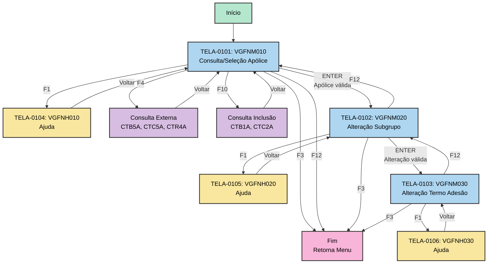

# 01 - Telas e Interface - VGFNA

## ⚠️ Referência à Matriz

**Arquivo da Matriz**: `MATRIZ_RASTREABILIDADE.csv`

Este documento referencia os seguintes tipos de ID:
- **TELA-NNNN**: Mapas/Telas 3270
- **OBJ-NNNN**: Campos de tela
- **FTELA-NNNN**: Funções de apresentação de tela
- **METOD-NNNN**: Funções que processam telas
- **REGRA-NNNN**: Regras de validação e comportamento

## Inventário de Telas

### Comando de Extração

```bash
.\vamap.exe _LEGADO/vgfna.esf --map
```

### Lista de Mapas Identificados

**Fonte da Matriz**: IDs em `MATRIZ_RASTREABILIDADE.csv` onde `Tipo='TELA'` para VGFNA

| ID Matriz | Nome Mapa | Descrição | Função que Abre | ID Função | Arquivo Legado | Linha |
|-----------|-----------|-----------|-----------------|-----------|----------------|-------|
| TELA-0101 | VGFNM010 | Tela alteração dados básicos (liberados) | VGFNP005 | FTELA-0101 | _LEGADO/vgfna.esf | 121 |
| TELA-0102 | VGFNM020 | Tela alteração dados básicos (subgrupo) | VGFNP025 | FTELA-0102 | _LEGADO/vgfna.esf | 288 |
| TELA-0103 | VGFNM030 | Tela alteração dados básicos (termo adesão) | VGFNP035 | FTELA-0103 | _LEGADO/vgfna.esf | 739 |
| TELA-0104 | VGFNH010 | Tela ajuda VGFNM010 | - | - | _LEGADO/vgfna.esf | 1192 |
| TELA-0105 | VGFNH020 | Tela ajuda VGFNM020 | - | - | _LEGADO/vgfna.esf | 1270 |
| TELA-0106 | VGFNH030 | Tela ajuda VGFNM030 | - | - | _LEGADO/vgfna.esf | 1326 |

---

## Detalhamento por Tela

### [TELA-0101] - VGFNM010 - Tela Alteração Dados Básicos (Liberados)

**Rastreabilidade** (da `MATRIZ_RASTREABILIDADE.csv`):
- **ID Matriz**: `TELA-0101`
- **Descrição**: VGFNM010 - Tela alteração dados básicos (liberados)
- **Arquivo Legado**: `_LEGADO/vgfna.esf`
- **Linha**: 121
- **Função de Abertura**: VGFNP005 (ID: `FTELA-0101`)

**Comando de Visualização**:
```bash
.\vamap.exe _LEGADO/vgfna.esf --map "VGFNM010"
```

**Layout Visual**:

```
VGFNM010
--------------------------------------------------------------------------------
FUNCOES QUE ABREM ESTE MAPA:
>VGFNP005
--------------------------------------------------------------------------------
                    A   ADMINISTRACAO INTEGRADA DE SEGUROS          01/01/000B  
 VGFNM010        C                                      D                    E  
                          ALTERACAO DADOS BASICOS (LIBERADOS)             F        
                                                                                
               APOLICE............:             G                              
                                            SUBGRUPO...........:               
                                                            H                  
                                                                                
                                                                                
                                                                                
                                                                                
                                                                                
                                                                                
                                                                                
                                                                                
                                                                                
                                                                                
                                                                                
                                                                                
                                                                                
                                                                                
                                                                                
                                                                            I  
 F1 - AJUDA   F2 -         F3 - SAIDA   F4 - CONSULTA F5 -         F6 -          
 F7 -         F8 -         F9 -         F10- INCLUSAO F11-         F12- CANCELA  
--------------------------------------------------------------------------------
MAPEAMENTOS:
A - MNUEMP
B - DATA
C - VERSAO
D - NOMSIS
E - HORA
F - GRUFUC = '                     ALTERACAO DADOS BASICOS (LIBERADOS)              '
G - NUM_APOLICE*
H - COD_SUBGRUPO
I - EZEMSG
--------------------------------------------------------------------------------
LEGENDA:
Campo read-only.
Campo editável.
Campo read-only sem tab.
* Campo com foco ao abrir a tela
```

**Mapeamento de Campos**:

**Fonte**: IDs em `MATRIZ_RASTREABILIDADE.csv` onde `Objeto_Pai='VGFNM010'` e `Tipo='OBJETO'`

| ID Matriz | Campo Mapa | Label | Tipo | Editável | Foco Inicial | Linha Legado |
|-----------|------------|-------|------|----------|--------------|--------------|
| OBJ-0101 | MNUEMP | Menu/Empresa | String | Não | Não | 132 |
| OBJ-0102 | DATA | Data do processamento | Date | Não | Não | 149 |
| OBJ-0103 | VERSAO | Versao do sistema | String | Não | Não | - |
| OBJ-0104 | NOMSIS | Nome do sistema | String | Não | Não | 171 |
| OBJ-0105 | HORA | Hora do sistema | Time | Não | Não | 189 |
| OBJ-0106 | GRUFUC | Grupo de funcoes | String | Não | Não | 207 |
| OBJ-0107 | NUM_APOLICE | Numero apolice | Numeric | Sim | **Sim** | 228 |
| OBJ-0108 | COD_SUBGRUPO | Codigo subgrupo | Numeric | Sim | Não | 249 |
| OBJ-0109 | EZEMSG | Mensagem sistema | String | Não | Não | 269 |

**Teclas de Função Habilitadas**:

| Tecla | ID Matriz Regra | Ação | Função Chamada | Descrição |
|-------|-----------------|------|----------------|-----------|
| F1 | - | Ajuda | - | Exibe tela de ajuda VGFNH010 |
| F3 | REGRA-0101, REGRA-0102 | Sair | ZZ01SGPS3 | Sai do programa |
| F4 | REGRA-0103 | Consulta | - | Consulta dados externos (CTB5A, CTC5A, CTR4A) |
| F10 | REGRA-0104 | Inclusão | - | Consulta dados para inclusão (CTB1A, CTC2A) |
| F12 | REGRA-0105, REGRA-0106 | Cancelar | ZZ01SGPS12 | Cancela operação |

**Comportamentos da Tela**:

**Inicialização**:
- Tela é exibida com cursor no campo NUM_APOLICE (OBJ-0107)
- Campos MNUEMP, DATA, VERSAO, NOMSIS, HORA, GRUFUC são preenchidos automaticamente
- Todos os campos de entrada ficam limpos aguardando entrada do usuário

**Validações de Entrada**:

| ID Regra | Validação | Condição | Ação |
|----------|-----------|----------|------|
| REGRA-0107 | Tecla válida | IF EZEAID NOT ENTER AND NOT PF3 AND NOT PF12 | Valida se tecla pressionada é válida |
| REGRA-0108 | Apólice informada | IF NUM_APOLICE<>0 | Verifica se apólice foi informada |
| REGRA-0109 | Apólice encontrada | IF V0APOLICE NOT NRF | Verifica se apólice existe no banco |

**Lógica de Negócio**:

A tela permite entrada da apólice e subgrupo para iniciar o processo de alteração:

1. **Entrada de Apólice** (OBJ-0107):
   - REGRA-0108: Verifica se NUM_APOLICE foi informado
   - REGRA-0109: Chama VGFNP011 para buscar dados da apólice
   - Se encontrada, carrega dados e navega para M020

2. **Entrada de Subgrupo** (OBJ-0108):
   - Opcional na tela M010
   - Utilizado como filtro adicional se informado

**Fluxo de Navegação**:

Após consulta bem-sucedida, navega para:
- **TELA-0102** (VGFNM020): Tela de alteração de subgrupo

---

### [TELA-0102] - VGFNM020 - Tela Alteração Dados Básicos (Subgrupo)

**Rastreabilidade**:
- **ID Matriz**: `TELA-0102`
- **Descrição**: VGFNM020 - Tela alteração dados básicos (subgrupo)
- **Arquivo Legado**: `_LEGADO/vgfna.esf`
- **Linha**: 288
- **Função de Abertura**: VGFNP025 (ID: `FTELA-0102`)

**Comando de Visualização**:
```bash
.\vamap.exe _LEGADO/vgfna.esf --map "VGFNM020"
```

**Layout Visual**:

```
VGFNM020
--------------------------------------------------------------------------------
FUNCOES QUE ABREM ESTE MAPA:
>VGFNP025
--------------------------------------------------------------------------------
                    A   ADMINISTRACAO INTEGRADA DE SEGUROS          01/01/000B  
 VGFNM020        C                                      D                    E  
                       ALTERA DADOS BASICOS (SUBGRUPO)                  F        
                                                                                
               APOLICE............:             G           - W01A0040          
                                            SUBGRUPO...........:               
                            H               - W02A0040                          
                                                                                
                                                                                
                    ----------------------------------------------              
                    --                                  DADOS CADASTRADOS        
                    -- ----------------------------------------------           
PERIODO FATURAMENTO:             I                                           
FORMA FATURAMENTO..:             J                                           
FORMA AVERBACAO....:             K                                           
TIPO PLANO.........:             L                                           
PLANO ASSOCIADO....:             M                                           
TIPO COBRANCA......:             N                                           
VALIDAR MATRICULA..:             O                                           
                                                                                
ENDERECO COBRANCA..:             P                                           
BANCO/AGENCIA/DAC..:             Q   R   S                                    
                                                                                
                                                                            T  
 F1 - AJUDA   F2 -         F3 - SAIDA   F4 -         F5 -         F6 -          
 F7 -         F8 -         F9 -         F10-         F11-         F12- CANCELA  
--------------------------------------------------------------------------------
MAPEAMENTOS:
A - MNUEMP
B - DATA
C - VERSAO
D - NOMSIS
E - HORA
F - GRUFUC
G - NUM_APOLICE
H - COD_SUBGRUPO
I - PERI_FATURAMENTO
J - FORMA_FATURAMENTO
K - FORMA_AVERBACAO
L - TIPO_PLANO
M - PLANO_ASSOCIADO
N - TIPO_COBRANCA
O - VALIDAR_MATRICULA
P - ENDERECO_COBRANCA
Q - BCO_COBRANCA
R - AGE_COBRANCA
S - DAC_COBRANCA
T - EZEMSG
```

**Descrição**:

Tela de edição que exibe e permite alteração dos dados cadastrados do subgrupo da apólice. Apresenta campos relacionados a faturamento, plano, cobrança e dados bancários.

**Características**:
- **Apólice**: Exibida em modo somente leitura (protegida)
- **Subgrupo**: Exibido em modo somente leitura (dark em toda a linha)
- **Campos Editáveis**: Período faturamento, forma faturamento, forma averbação, tipo plano, plano associado, tipo cobrança, validar matrícula, endereço cobrança, banco/agência/DAC
- **Validações Cruzadas**: Dependem do tipo de cobrança e tipo de apólice

**Teclas de Função**:

| Tecla | Ação | Descrição |
|-------|------|-----------|
| F1 | Ajuda | Exibe tela VGFNH020 |
| F3 | Sair | Retorna ao menu principal |
| F12 | Cancelar | Retorna à tela VGFNM010 |
| ENTER | Confirmar | Valida e salva alterações se dados consistentes |

**Fluxo de Navegação**:

Após alteração bem-sucedida ou seleção, navega para:
- **TELA-0103** (VGFNM030): Tela de alteração de termo adesão
- **TELA-0101** (VGFNM010): Retorno via F12

---

### [TELA-0103] - VGFNM030 - Tela Alteração Dados Básicos (Termo Adesão)

**Rastreabilidade**:
- **ID Matriz**: `TELA-0103`
- **Descrição**: VGFNM030 - Tela alteração dados básicos (termo adesão)
- **Arquivo Legado**: `_LEGADO/vgfna.esf`
- **Linha**: 739
- **Função de Abertura**: VGFNP035 (ID: `FTELA-0103`)

**Comando de Visualização**:
```bash
.\vamap.exe _LEGADO/vgfna.esf --map "VGFNM030"
```

**Descrição**:

Tela de edição que exibe e permite alteração dos dados cadastrados do termo adesão da apólice. Campos similares à tela M020 mas específicos para termo adesão.

**Características**:
- **Apólice**: Exibida em modo somente leitura
- **Campos Editáveis**: Semelhantes à M020 mas aplicados ao termo adesão
- **Validações**: Mesmas validações cruzadas da M020

**Teclas de Função**:

| Tecla | Ação | Descrição |
|-------|------|-----------|
| F1 | Ajuda | Exibe tela VGFNH030 |
| F3 | Sair | Retorna ao menu principal |
| F12 | Cancelar | Retorna à tela VGFNM020 |

---

## Fluxo Geral de Navegação



---

## Estruturas de Dados Relacionadas

As telas utilizam as seguintes estruturas de dados:

- **ENT-0101**: V0APOLICE - Tabela apólice
- **ENT-0102**: V0SUBGRUPO - Tabela subgrupo
- **ENT-0103**: V0TERMOADESAO - Tabela termo adesão
- **ENT-0104**: V1CLIENTE - Tabela cliente
- **ENT-0105**: V1ENDERECOS - Tabela endereços
- **ENT-0106**: V1AGENCIAS - Tabela agências bancárias
- **ENT-0107**: V1FONTE - Tabela fontes produtoras
- **ENT-0108**: VGFNW001 - Workstorage principal

---

## Regras de Negócio Aplicadas

### Validações da Tela Principal (VGFNM010)

| ID Regra | Descrição | Arquivo | Linha |
|----------|-----------|---------|-------|
| REGRA-0101 | IF EZEAID=PF3 - Testa tecla F3 sair | vgfna.esf | ~3100 |
| REGRA-0102 | CALL ZZ01SGPS3 - Funcao sair | vgfna.esf | ~3101 |
| REGRA-0103 | IF EZEAID=PF4 - Testa tecla F4 consulta | vgfna.esf | ~3105 |
| REGRA-0104 | IF EZEAID=PF10 - Testa tecla F10 inclusão | vgfna.esf | ~3110 |
| REGRA-0105 | IF EZEAID=PF12 - Testa tecla F12 cancelar | vgfna.esf | ~3115 |
| REGRA-0106 | CALL ZZ01SGPS12 - Funcao cancelar | vgfna.esf | ~3116 |
| REGRA-0107 | IF EZEAID NOT ENTER - Valida tecla invalida | vgfna.esf | ~3120 |
| REGRA-0108 | IF NUM_APOLICE<>0 - Verifica apolice informada | vgfna.esf | ~3125 |
| REGRA-0109 | CALL VGFNP011 - Busca apolice no banco | vgfna.esf | ~3130 |

### Validações da Tela M020 (VGFNM020)

| ID Regra | Descrição | Arquivo | Linha |
|----------|-----------|---------|-------|
| REGRA-0110 | IF TIPO_COBRANCA=2 - Valida tipo cobranca fatura | vgfna.esf | ~3200 |
| REGRA-0111 | IF TIPO_COBRANCA=2 - PERI_FATURAMENTO obrigatorio | vgfna.esf | ~3205 |
| REGRA-0112 | IF TIPO_COBRANCA=2 - FORMA_FATURAMENTO obrigatorio | vgfna.esf | ~3210 |
| REGRA-0113 | IF TIPO_APOLICE=2 - VALIDAR_MATRICULA apenas 'S' | vgfna.esf | ~3220 |
| REGRA-0114 | IF TIPO_COBRANCA=2 AND TIPO_APOLICE=2 - Protege campos | vgfna.esf | ~3225 |

---

## Mensagens de Usuário

| Código | Tipo | Mensagem | Quando Exibida | Campo |
|--------|------|----------|----------------|-------|
| - | Info | Alteração realizada com sucesso | Após alteração bem-sucedida | EZEMSG |
| - | Warning | Apólice não encontrada | Quando consulta não retorna dados | EZEMSG |
| - | Error | Tecla invalida | Quando tecla não esperada é pressionada | EZEMSG |
| - | Error | Informar apólice | Quando apólice está vazia ao pressionar ENTER | EZEMSG |
| - | Error | Período faturamento obrigatório | Quando tipo cobrança=2 e período não informado | EZEMSG |

---

## Resumo de Atualizações para Matriz

Os seguintes elementos foram documentados neste arquivo:

| ID Matriz | Elemento | Tipo | Descrição | Linhas |
|-----------|----------|------|-----------|--------|
| TELA-0101 | VGFNM010 | TELA | Tela alteração dados básicos (liberados) | 49-159 |
| TELA-0102 | VGFNM020 | TELA | Tela alteração dados básicos (subgrupo) | 161-217 |
| TELA-0103 | VGFNM030 | TELA | Tela alteração dados básicos (termo adesão) | 219-269 |
| TELA-0104 | VGFNH010 | TELA | Tela ajuda VGFNM010 | 35 |
| TELA-0105 | VGFNH020 | TELA | Tela ajuda VGFNM020 | 36 |
| TELA-0106 | VGFNH030 | TELA | Tela ajuda VGFNM030 | 37 |
| OBJ-0101 | MNUEMP | OBJETO | Menu/Empresa | 78 |
| OBJ-0102 | DATA | OBJETO | Data do processamento | 79 |
| OBJ-0103 | VERSAO | OBJETO | Versao do sistema | 80 |
| OBJ-0104 | NOMSIS | OBJETO | Nome do sistema | 81 |
| OBJ-0105 | HORA | OBJETO | Hora do sistema | 82 |
| OBJ-0106 | GRUFUC | OBJETO | Grupo de funcoes | 83 |
| OBJ-0107 | NUM_APOLICE | OBJETO | Numero apolice (foco inicial) | 84 |
| OBJ-0108 | COD_SUBGRUPO | OBJETO | Codigo subgrupo | 85 |
| OBJ-0109 | EZEMSG | OBJETO | Mensagem sistema | 86 |
| FTELA-0101 | VGFNP005 | FUNCAO_TELA | Apresenta tela M010 | 44, 54 |
| FTELA-0102 | VGFNP025 | FUNCAO_TELA | Apresenta tela M020 | 44, 168 |
| FTELA-0103 | VGFNP035 | FUNCAO_TELA | Apresenta tela M030 | 44, 226 |
| REGRA-0101 | IF EZEAID=PF3 | REGRA | Testa tecla F3 sair | 391 |
| REGRA-0102 | CALL ZZ01SGPS3 | REGRA | Funcao sair | 392 |
| REGRA-0103 | IF EZEAID=PF4 | REGRA | Testa tecla F4 consulta | 393 |
| REGRA-0104 | IF EZEAID=PF10 | REGRA | Testa tecla F10 inclusão | 394 |
| REGRA-0105 | IF EZEAID=PF12 | REGRA | Testa tecla F12 cancelar | 395 |
| REGRA-0106 | CALL ZZ01SGPS12 | REGRA | Funcao cancelar | 396 |
| REGRA-0107 | IF EZEAID NOT ENTER | REGRA | Valida tecla invalida | 397 |
| REGRA-0108 | IF NUM_APOLICE<>0 | REGRA | Verifica apolice informada | 398 |
| REGRA-0109 | CALL VGFNP011 | REGRA | Busca apolice no banco | 399 |

**Total**: 29 elementos documentados (6 TELAS + 9 OBJs + 3 FTELAs + 9 REGRAs + Referências ENTs)

---

## ⚠️ Atualização da Matriz Necessária

Deseja atualizar a `MATRIZ_RASTREABILIDADE.csv` com essas referências?

**Campos a atualizar**:
- `Ref_Doc_AsIs` = `01_TELAS_INTERFACE_VGFNA.md`
- `Ref_Doc_AsIs_Linhas` = conforme tabela acima
- `Status_Documentacao` = `OK`

**Aguardando aprovação do usuário...**

