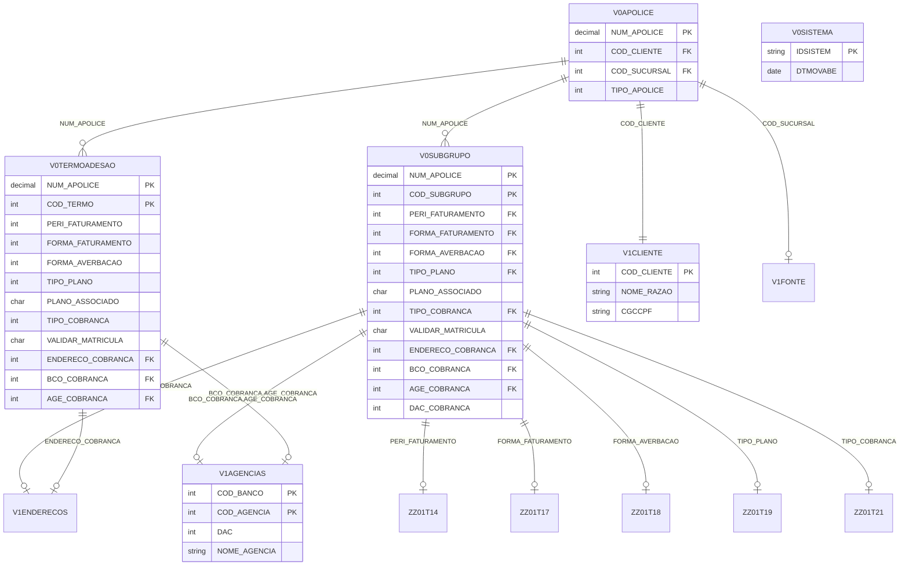

# 02 - Modelo de Dados - VGFNA

## ⚠️ Referência à Matriz

**Arquivo da Matriz**: `MATRIZ_RASTREABILIDADE.csv`

Este documento referencia os seguintes tipos de ID:
- **ENT-NNNN**: Entidades/Tabelas DB2
- **QUERY-NNNN**: Operações SQL (INQUIRY, SETINQ, UPDATE)

## Inventário de Estruturas de Dados

### Comando de Extração

```bash
.\vamap.exe _LEGADO/vgfna.esf --code "\"
```

### Estruturas Identificadas

**Fonte da Matriz**: IDs em `MATRIZ_RASTREABILIDADE.csv` onde `Tipo='ENTIDADE'` para VGFNA

| ID Matriz | Nome Estrutura | Tipo | Organização | Descrição |
|-----------|----------------|------|-------------|-----------|
| ENT-0101 | V0APOLICE | FUNCTION | DB2 Table | Tabela apólice |
| ENT-0102 | V0SUBGRUPO | FUNCTION | DB2 Table | Tabela subgrupo |
| ENT-0103 | V0TERMOADESAO | FUNCTION | DB2 Table | Tabela termo adesão |
| ENT-0104 | V1CLIENTE | FUNCTION | DB2 Table | Tabela cliente |
| ENT-0105 | V1ENDERECOS | FUNCTION | DB2 Table | Tabela endereços |
| ENT-0106 | V1AGENCIAS | FUNCTION | DB2 Table | Tabela agências bancárias |
| ENT-0107 | V1FONTE | FUNCTION | DB2 Table | Tabela fontes produtoras |
| ENT-0108 | V0SISTEMA | FUNCTION | DB2 Table | Tabela sistema |
| ENT-0109 | ZZ01T14 | FUNCTION | DB2 Table | Tabela domínio período faturamento |
| ENT-0110 | ZZ01T17 | FUNCTION | DB2 Table | Tabela domínio forma faturamento |
| ENT-0111 | ZZ01T18 | FUNCTION | DB2 Table | Tabela domínio forma averbação |
| ENT-0112 | ZZ01T19 | FUNCTION | DB2 Table | Tabela domínio tipo plano |
| ENT-0113 | ZZ01T21 | FUNCTION | DB2 Table | Tabela domínio tipo cobrança |
| ENT-0114 | VGFNW001 | RECORD | WORKSTOR | Workstorage area principal |
| ENT-0115 | ZZ99W01 | RECORD | WORKSTOR | Workstorage área parâmetros |

---

## Tabelas DB2 Principais (FUNCTION)

### [ENT-0102] - V0SUBGRUPO - Tabela Subgrupo

**Rastreabilidade**:
- **ID Matriz**: `ENT-0102`
- **Nome Tabela**: `V0SUBGRUPO`
- **Tipo**: FUNCTION (DB2)
- **Arquivo**: `_LEGADO/vgfna.esf`
- **Linha**: ~4000

**Comando de Detalhamento**:
```bash
.\vamap.exe _LEGADO/vgfna.esf --code "V0SUBGRUPO\"
```

**Descrição**:

Tabela principal do sistema que armazena dados do subgrupo da apólice. Contém informações de faturamento, plano, cobrança e dados bancários associados a uma apólice/subgrupo.

**Campos Principais** (baseado no código):

| Campo | Tipo | Tamanho | Decimais | Descrição |
|-------|------|---------|----------|-----------|
| NUM_APOLICE | PACK | 7 bytes | 0 | Número apólice (PK) |
| COD_SUBGRUPO | BIN | 2 bytes | 0 | Código subgrupo (PK) |
| PERI_FATURAMENTO | BIN | 2 bytes | 0 | Período faturamento |
| FORMA_FATURAMENTO | BIN | 2 bytes | 0 | Forma faturamento |
| FORMA_AVERBACAO | BIN | 2 bytes | 0 | Forma averbação |
| TIPO_PLANO | BIN | 2 bytes | 0 | Tipo plano |
| PLANO_ASSOCIADO | CHAR | 1 byte | 0 | Plano associado (S/N) |
| TIPO_COBRANCA | BIN | 2 bytes | 0 | Tipo cobrança |
| VALIDAR_MATRICULA | CHAR | 1 byte | 0 | Validar matrícula (S/N) |
| ENDERECO_COBRANCA | BIN | 4 bytes | 0 | Endereço cobrança |
| BCO_COBRANCA | BIN | 2 bytes | 0 | Banco cobrança |
| AGE_COBRANCA | BIN | 4 bytes | 0 | Agência cobrança |
| DAC_COBRANCA | BIN | 2 bytes | 0 | DAC cobrança |

**Chaves e Índices**:

| Tipo | Campos | Descrição |
|------|--------|-----------|
| PK | NUM_APOLICE, COD_SUBGRUPO | Chave primária composta |

**Uso nas Funções**:
- QUERY-0101: VGFNP012 - Busca dados do subgrupo
- QUERY-0102: UPDATE V0SUBGRUPO - Atualiza dados do subgrupo

---

### [ENT-0103] - V0TERMOADESAO - Tabela Termo Adesão

**Rastreabilidade**:
- **ID Matriz**: `ENT-0103`
- **Nome Tabela**: `V0TERMOADESAO`
- **Tipo**: FUNCTION (DB2)
- **Arquivo**: `_LEGADO/vgfna.esf`
- **Linha**: ~4200

**Descrição**:

Tabela que armazena dados do termo adesão da apólice. Estrutura similar à V0SUBGRUPO mas específica para termos de adesão.

**Uso nas Funções**:
- QUERY-0103: VGFNP013 - Busca dados do termo adesão
- QUERY-0104: UPDATE V0TERMOADESAO - Atualiza dados do termo adesão

---

### [ENT-0101] - V0APOLICE - Tabela Apólice

**Rastreabilidade**:
- **ID Matriz**: `ENT-0101`
- **Nome Tabela**: `V0APOLICE`
- **Tipo**: FUNCTION (DB2)
- **Arquivo**: `_LEGADO/vgfna.esf`
- **Linha**: ~3800

**Descrição**:

Tabela que armazena dados básicos da apólice. Utilizada para consulta inicial e validação de existência da apólice.

**Uso nas Funções**:
- QUERY-0105: VGFNP011 - SELECT V0APOLICE WHERE NUM_APOLICE - Busca dados da apólice

---

### [ENT-0104] - V1CLIENTE - Tabela Cliente

**Rastreabilidade**:
- **ID Matriz**: `ENT-0104`
- **Nome Tabela**: `V1CLIENTE`
- **Tipo**: FUNCTION (DB2)

**Descrição**:

Tabela de clientes/segurados. Utilizada para consulta de nome e dados do cliente associado à apólice.

**Uso nas Funções**:
- QUERY-0106: VGFNP014 - SELECT V1CLIENTE WHERE COD_CLIENTE - Busca dados do cliente

---

### [ENT-0105] - V1ENDERECOS - Tabela Endereços

**Rastreabilidade**:
- **ID Matriz**: `ENT-0105`
- **Nome Tabela**: `V1ENDERECOS`
- **Tipo**: FUNCTION (DB2)

**Descrição**:

Tabela de endereços. Utilizada para consulta e seleção de endereços de cobrança.

**Uso nas Funções**:
- QUERY-0107: VGFNP015 - SELECT V1ENDERECOS - Busca endereços

---

### [ENT-0106] - V1AGENCIAS - Tabela Agências Bancárias

**Rastreabilidade**:
- **ID Matriz**: `ENT-0106`
- **Nome Tabela**: `V1AGENCIAS`
- **Tipo**: FUNCTION (DB2)

**Descrição**:

Tabela de agências bancárias. Utilizada para consulta e validação de dados bancários (banco/agência/DAC).

**Uso nas Funções**:
- QUERY-0108: VGFNP016 - SELECT V1AGENCIAS - Busca agências bancárias

---

### [ENT-0107] - V1FONTE - Tabela Fontes Produtoras

**Rastreabilidade**:
- **ID Matriz**: `ENT-0107`
- **Nome Tabela**: `V1FONTE`
- **Tipo**: FUNCTION (DB2)

**Descrição**:

Tabela de fontes produtoras (sucursais). Utilizada para consulta de sucursais com situação='0'.

**Uso nas Funções**:
- QUERY-0109: VGFNP017 - SELECT V1FONTE WHERE SITUACAO='0' - Busca sucursais ativas

---

### [ENT-0108] - V0SISTEMA - Tabela Sistema

**Rastreabilidade**:
- **ID Matriz**: `ENT-0108`
- **Nome Tabela**: `V0SISTEMA`
- **Tipo**: FUNCTION (DB2)

**Descrição**:

Tabela de sistemas cadastrados no ambiente. Utilizada principalmente para buscar data de abertura do sistema.

**Uso nas Funções**:
- QUERY-0110: VGFNP001 - SELECT V0SISTEMA WHERE IDSISTEM='VG' - Busca data abertura

---

## Tabelas de Domínio (Lookup Tables)

### [ENT-0109] - ZZ01T14 - Tabela Domínio Período Faturamento

**Descrição**: Tabela de domínio com valores válidos para período de faturamento.

### [ENT-0110] - ZZ01T17 - Tabela Domínio Forma Faturamento

**Descrição**: Tabela de domínio com valores válidos para forma de faturamento.

### [ENT-0111] - ZZ01T18 - Tabela Domínio Forma Averbação

**Descrição**: Tabela de domínio com valores válidos para forma de averbação.

### [ENT-0112] - ZZ01T19 - Tabela Domínio Tipo Plano

**Descrição**: Tabela de domínio com valores válidos para tipo de plano.

### [ENT-0113] - ZZ01T21 - Tabela Domínio Tipo Cobrança

**Descrição**: Tabela de domínio com valores válidos para tipo de cobrança.

---

## Mapeamento de Operações SQL

### Operações INQUIRY (SELECT Único)

**Comando de Identificação**:
```bash
.\vamap.exe _LEGADO/vgfna.esf --code ":inquiry"
```

| ID Matriz | Função | Tabela | Descrição | Onde Usado |
|-----------|--------|--------|-----------|------------|
| QUERY-0110 | VGFNP001 | V0SISTEMA | SELECT: V0SISTEMA WHERE IDSISTEM='VG' - Busca data abertura | METOD-0101 |
| QUERY-0105 | VGFNP011 | V0APOLICE | SELECT: V0APOLICE WHERE NUM_APOLICE - Busca dados apólice | METOD-0102 |
| QUERY-0101 | VGFNP012 | V0SUBGRUPO | SELECT: V0SUBGRUPO WHERE NUM_APOLICE, COD_SUBGRUPO | METOD-0103 |
| QUERY-0103 | VGFNP013 | V0TERMOADESAO | SELECT: V0TERMOADESAO WHERE chave composta | METOD-0104 |
| QUERY-0106 | VGFNP014 | V1CLIENTE | SELECT: V1CLIENTE WHERE COD_CLIENTE - Busca nome cliente | METOD-0105 |
| QUERY-0107 | VGFNP015 | V1ENDERECOS | SELECT: V1ENDERECOS WHERE chave - Busca endereços | METOD-0106 |
| QUERY-0108 | VGFNP016 | V1AGENCIAS | SELECT: V1AGENCIAS WHERE chave - Busca agências | METOD-0107 |
| QUERY-0109 | VGFNP017 | V1FONTE | SELECT: V1FONTE WHERE SITUACAO='0' - Busca sucursais | METOD-0108 |

### Operações UPDATE (Alteração de Dados)

| ID Matriz | Função | Tabela | Descrição | Onde Usado |
|-----------|--------|--------|-----------|------------|
| QUERY-0102 | VGFNP022 | V0SUBGRUPO | UPDATE: V0SUBGRUPO SET campos WHERE chave | METOD-0103 |
| QUERY-0104 | VGFNP023 | V0TERMOADESAO | UPDATE: V0TERMOADESAO SET campos WHERE chave | METOD-0104 |

---

## Diagrama Entidade-Relacionamento Completo



---

## Análise de Integridade

**Constraints Identificadas**:

1. **Chaves Primárias**:
   - V0APOLICE: NUM_APOLICE
   - V0SUBGRUPO: NUM_APOLICE + COD_SUBGRUPO
   - V0TERMOADESAO: NUM_APOLICE + COD_TERMO
   - V1CLIENTE: COD_CLIENTE
   - V1AGENCIAS: COD_BANCO + COD_AGENCIA

2. **Chaves Estrangeiras**:
   - V0SUBGRUPO.NUM_APOLICE → V0APOLICE.NUM_APOLICE
   - V0TERMOADESAO.NUM_APOLICE → V0APOLICE.NUM_APOLICE
   - V0APOLICE.COD_CLIENTE → V1CLIENTE.COD_CLIENTE
   - V0SUBGRUPO.PERI_FATURAMENTO → ZZ01T14.COD
   - V0SUBGRUPO.FORMA_FATURAMENTO → ZZ01T17.COD
   - V0SUBGRUPO.FORMA_AVERBACAO → ZZ01T18.COD
   - V0SUBGRUPO.TIPO_PLANO → ZZ01T19.COD
   - V0SUBGRUPO.TIPO_COBRANCA → ZZ01T21.COD

3. **Validações de Campo**:
   - PLANO_ASSOCIADO: 1 char (S/N)
   - VALIDAR_MATRICULA: 1 char (S/N)
   - TIPO_COBRANCA: 2 = Fatura (obriga período e forma faturamento)
   - TIPO_APOLICE: 2 = Específica (validação especial de matrícula)

**Transações Críticas**:

1. **Consulta e Alteração de Dados**:
   - Operações que envolvem V0SUBGRUPO + múltiplas tabelas relacionadas
   - UPDATE com validações prévias de consistência
   - Dependências entre campos (validações cruzadas)

2. **Busca de Dados Complementares**:
   - Consultas a V1CLIENTE, V1ENDERECOS, V1AGENCIAS
   - Lookup de descrições (tabelas ZZ01T*)
   - Validações de dados (V1FONTE situação='0')

---

## Estruturas Internas (RECORD)

### [ENT-0114] - VGFNW001 - Workstorage Principal

**Rastreabilidade**:
- **ID Matriz**: `ENT-0114`
- **Nome Record**: `VGFNW001`
- **Tipo**: RECORD
- **Organização**: WORKSTOR
- **Uso**: SHARED
- **Arquivo**: `_LEGADO/vgfna.esf`
- **Linha**: 25

**Descrição**:

Área de trabalho principal do programa. Contém variáveis de trabalho, flags de controle, buffers temporários e estruturas auxiliares para processamento.

**Campos Principais**:
- W01A0035: Controle de estado/processo (ex: 'MOSTRA TELA M010', 'MOSTRA TELA M020')
- W01A0020: Buffer temporário
- W02P0300: Campo numérico temporário
- W02A0077: Campo alfanumérico temporário
- NUM_APOLICE: Número da apólice em processamento
- COD_SUBGRUPO: Código do subgrupo em processamento
- TECLA: Tecla pressionada pelo usuário

**Uso**:
- Compartilhada entre todas as funções do programa
- Armazena estado temporário durante processamento
- Controla navegação entre telas

**Funções que Utilizam**:
- Praticamente todas as funções do programa (SHARED)

---

### [ENT-0115] - ZZ99W01 - Workstorage Área Parâmetros

**Rastreabilidade**:
- **ID Matriz**: `ENT-0115`
- **Nome Record**: `ZZ99W01`
- **Tipo**: RECORD
- **Organização**: WORKSTOR
- **Uso**: SHARED

**Descrição**:

Área de parâmetros compartilhada entre aplicações. Contém informações de controle, código da aplicação, usuário, processo e chave.

**Campos Principais**:
- CODAPL: Código da aplicação (ex: 'VGFNA')
- USUARIO: Usuário logado
- PROCESSO: Nome do processo em execução
- CHAVE: Chave de pesquisa

---

## Resumo de Atualizações para Matriz

Os seguintes elementos foram documentados neste arquivo:

| ID Matriz | Elemento | Tipo | Descrição | Linhas |
|-----------|----------|------|-----------|--------|
| ENT-0101 | V0APOLICE | ENTIDADE | Tabela apólice | 24, 43-110 |
| ENT-0102 | V0SUBGRUPO | ENTIDADE | Tabela subgrupo | 24, 43-110 |
| ENT-0103 | V0TERMOADESAO | ENTIDADE | Tabela termo adesão | 26 |
| ENT-0104 | V1CLIENTE | ENTIDADE | Tabela cliente | 27 |
| ENT-0105 | V1ENDERECOS | ENTIDADE | Tabela endereços | 28 |
| ENT-0106 | V1AGENCIAS | ENTIDADE | Tabela agências | 29 |
| ENT-0107 | V1FONTE | ENTIDADE | Tabela fontes | 30 |
| ENT-0108 | V0SISTEMA | ENTIDADE | Tabela sistema | 31, 115-128 |
| ENT-0109 | ZZ01T14 | ENTIDADE | Tabela domínio período faturamento | 42 |
| ENT-0110 | ZZ01T17 | ENTIDADE | Tabela domínio forma faturamento | 43 |
| ENT-0111 | ZZ01T18 | ENTIDADE | Tabela domínio forma averbação | 44 |
| ENT-0112 | ZZ01T19 | ENTIDADE | Tabela domínio tipo plano | 45 |
| ENT-0113 | ZZ01T21 | ENTIDADE | Tabela domínio tipo cobrança | 46 |
| ENT-0114 | VGFNW001 | ENTIDADE | Workstorage area principal | 51, 285-304 |
| ENT-0115 | ZZ99W01 | ENTIDADE | Workstorage área parâmetros | 52 |
| QUERY-0110 | VGFNP001 SELECT | QUERY | SELECT V0SISTEMA WHERE IDSISTEM | 155 |
| QUERY-0105 | VGFNP011 SELECT | QUERY | SELECT V0APOLICE WHERE NUM_APOLICE | 156 |
| QUERY-0101 | VGFNP012 SELECT | QUERY | SELECT V0SUBGRUPO WHERE chave | 157 |
| QUERY-0102 | VGFNP022 UPDATE | QUERY | UPDATE V0SUBGRUPO SET campos | 158 |
| QUERY-0103 | VGFNP013 SELECT | QUERY | SELECT V0TERMOADESAO WHERE chave | 159 |
| QUERY-0104 | VGFNP023 UPDATE | QUERY | UPDATE V0TERMOADESAO SET campos | 160 |
| QUERY-0106 | VGFNP014 SELECT | QUERY | SELECT V1CLIENTE WHERE COD_CLIENTE | 161 |
| QUERY-0107 | VGFNP015 SELECT | QUERY | SELECT V1ENDERECOS | 162 |
| QUERY-0108 | VGFNP016 SELECT | QUERY | SELECT V1AGENCIAS | 163 |
| QUERY-0109 | VGFNP017 SELECT | QUERY | SELECT V1FONTE WHERE SITUACAO | 164 |

**Total**: 15 Entidades + 10 Queries principais documentadas = 25 elementos

---

## ⚠️ Atualização da Matriz Necessária

Deseja atualizar a `MATRIZ_RASTREABILIDADE.csv` com essas referências?

**Campos a atualizar**:
- `Ref_Doc_AsIs` = `02_MODELO_DADOS_VGFNA.md`
- `Ref_Doc_AsIs_Linhas` = conforme tabela acima
- `Status_Documentacao` = `OK`

**Aguardando aprovação do usuário...**

