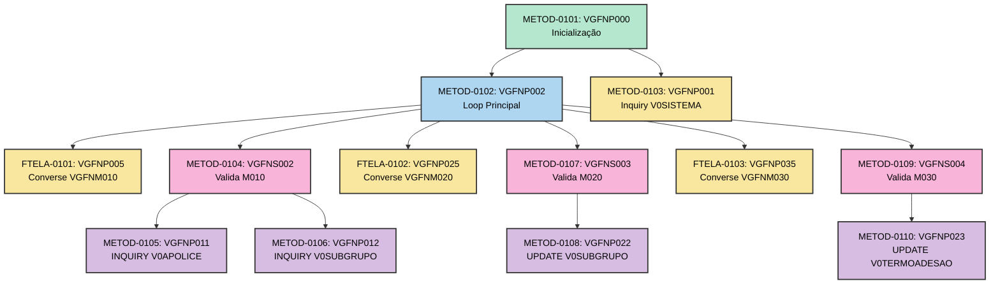
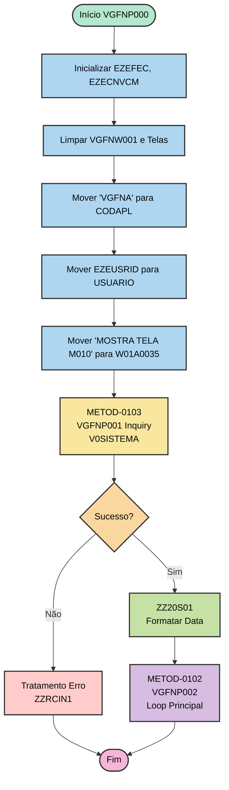
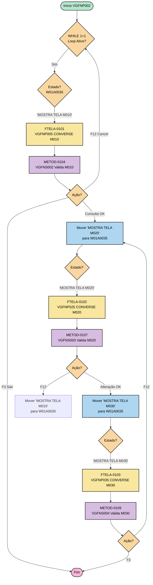
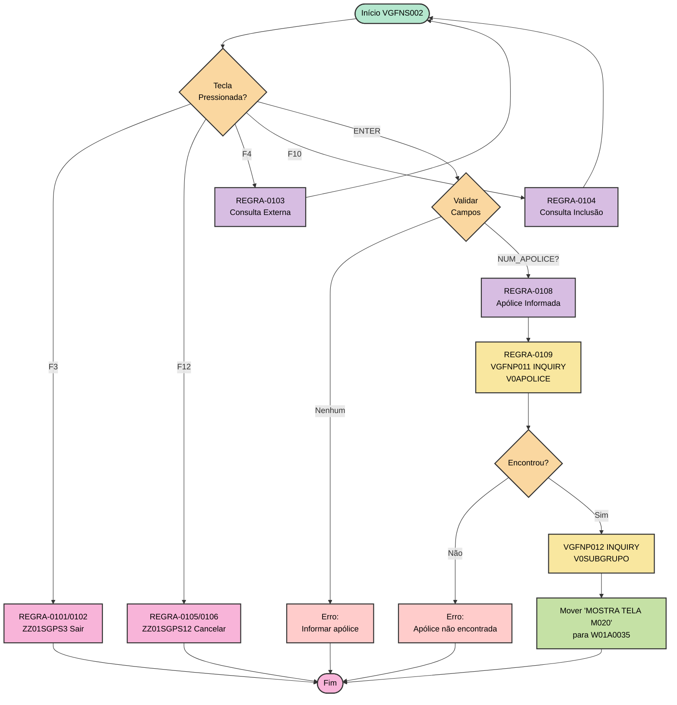
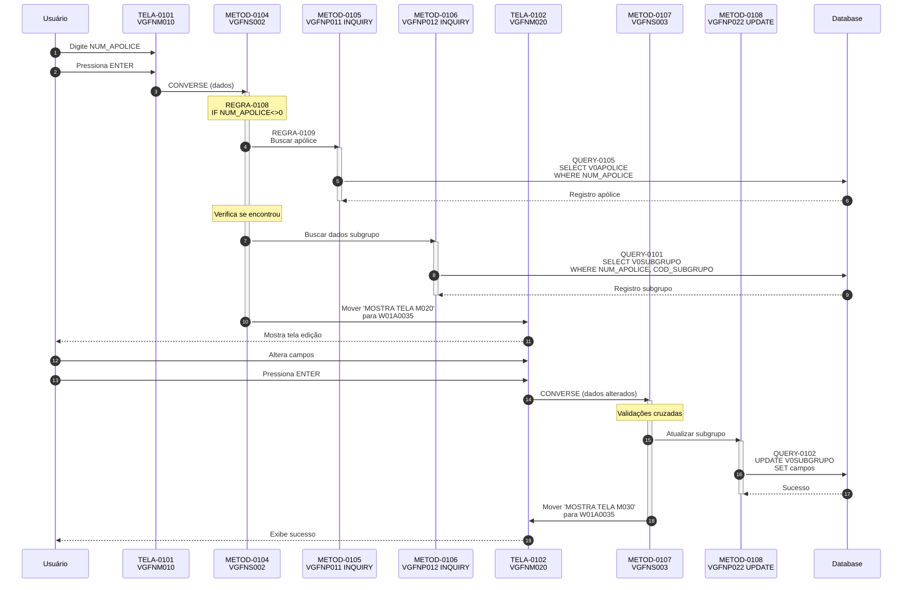
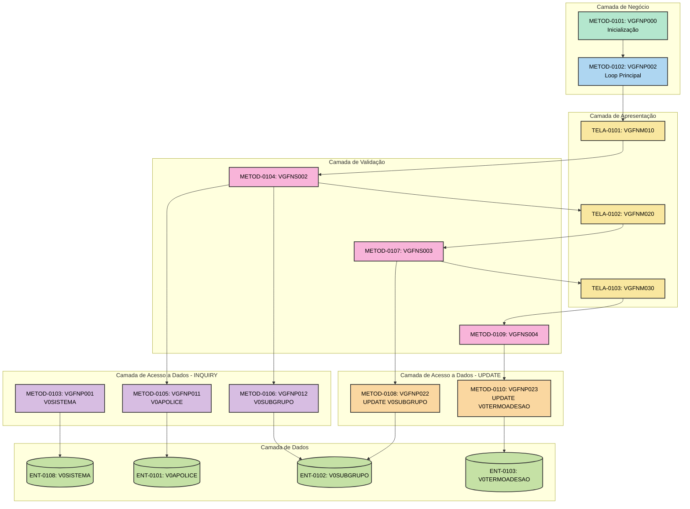

# 03 - Fluxo de Execução - VGFNA

## ⚠️ Referência à Matriz

**Arquivo da Matriz**: `MATRIZ_RASTREABILIDADE.csv`

Este documento referencia os seguintes tipos de ID:
- **METOD-NNNN**: Funções/Procedures do programa
- **TELA-NNNN**: Telas envolvidas no fluxo
- **QUERY-NNNN**: Operações SQL
- **REGRA-NNNN**: Regras de negócio aplicadas

## Visão Geral do Stack

### Comando de Extração

```bash
.\vamap.exe _LEGADO/vgfna.esf --code "|"
```

**Stack Completo**:

```
MainFunc (SourceCode)
:mainfun   name      = VGFNP002.
IF VGFNW001.W01A0035 EQ 'PROCESSO INICIAL';
  VGFNP000();
END;
VGFNP002();
:emainfun.

VGFNP000 - Execute
  VGFNP001 - Inquiry
    ZZRCIN1 - Error Handling Function Execute
    ZZ20S01 - Execute
VGFNP002 - Execute
  VGFNP005 - Converse
  VGFNS002 - Execute
    ZZ01SGPS3 - Execute
    ZZ01SGPS12 - Execute
    VGFNP011 - Inquiry
      ZZRCIN1 - Error Handling Function Execute
    VGFNP012 - Inquiry
      ZZRCIN1 - Error Handling Function Execute
  VGFNP025 - Converse
  VGFNS003 - Execute
    VGFNP022 - Update
      ZZRCIN2 - Error Handling Function Execute
  VGFNP035 - Converse
  VGFNS004 - Execute
    VGFNP023 - Update
      ZZRCIN2 - Error Handling Function Execute
```

**Hierarquia de Funções**:



---

## Fluxo Principal de Execução

### 1. Inicialização (METOD-0101)

**Rastreabilidade**:
- **ID Matriz**: `METOD-0101`
- **Função**: `VGFNP000`
- **Tipo**: Main Entry Point
- **Arquivo**: `_LEGADO/vgfna.esf`
- **Linhas**: 2861-2881

**Comando de Visualização**:
```bash
.\vamap.exe _LEGADO/vgfna.esf --code "VGFNP000"
```

**Descrição**:
- Inicializa variáveis globais (EZEFEC, EZECNVCM)
- Limpa workstorage (VGFNW001) e telas (VGFNM010, VGFNM020, VGFNM030)
- Define código da aplicação e usuário
- Define estado inicial: 'MOSTRA TELA M010'
- Chama função para buscar data de abertura do sistema (VGFNP001)
- Chama função principal VGFNP002 (METOD-0102)

**Fluxo**:



**Chamado por**: Ninguém (entry point condicional)

**Chama**:
- `METOD-0103`: VGFNP001 (QUERY-0110 - V0SISTEMA)
- `METOD-0102`: VGFNP002 (loop principal)

**Estruturas Usadas**:
- `ENT-0114`: VGFNW001 (workstorage)
- `ENT-0115`: ZZ99W01 (workstorage parâmetros)
- `ENT-0108`: V0SISTEMA (tabela)

---

### 2. Loop Principal (METOD-0102)

**Rastreabilidade**:
- **ID Matriz**: `METOD-0102`
- **Função**: `VGFNP002`
- **Tipo**: Execute (Loop)
- **Arquivo**: `_LEGADO/vgfna.esf`
- **Linhas**: 2918-2951

**Descrição**:

Loop principal de controle de telas. Gerencia navegação entre as 3 telas principais do sistema (VGFNM010, VGFNM020, VGFNM030) baseado no estado armazenado em VGFNW001.W01A0035.

**Fluxo**:



**Chamado por**: 
- `METOD-0101`: VGFNP000 (inicialização)

**Chama**:
- `FTELA-0101`: VGFNP005 (CONVERSE VGFNM010)
- `METOD-0104`: VGFNS002 (validação M010)
- `FTELA-0102`: VGFNP025 (CONVERSE VGFNM020)
- `METOD-0107`: VGFNS003 (validação M020)
- `FTELA-0103`: VGFNP035 (CONVERSE VGFNM030)
- `METOD-0109`: VGFNS004 (validação M030)

---

### 3. Validação Tela M010 (METOD-0104)

**Rastreabilidade**:
- **ID Matriz**: `METOD-0104`
- **Função**: `VGFNS002`
- **Tipo**: Execute (Validação)
- **Arquivo**: `_LEGADO/vgfna.esf`
- **Linhas**: ~3100-3300

**Descrição**:

Valida e processa a tela de consulta inicial (VGFNM010). Implementa a lógica de entrada de apólice, validação de teclas e consulta de dados.

**Fluxo**:



**Chamado por**:
- `METOD-0102`: VGFNP002 (loop principal)

**Chama**:
- `METOD-0105`: VGFNP011 (INQUIRY por apólice)
- `METOD-0106`: VGFNP012 (INQUIRY por subgrupo)

**Regras de Negócio**:
- `REGRA-0101` a `REGRA-0109`: Validações e chamadas de funções

---

### 4. Validação Tela M020 (METOD-0107)

**Rastreabilidade**:
- **ID Matriz**: `METOD-0107`
- **Função**: `VGFNS003`
- **Tipo**: Execute (Validação e Business Logic)
- **Arquivo**: `_LEGADO/vgfna.esf`
- **Linhas**: ~3400-3600

**Descrição**:

Valida e processa a tela de alteração de subgrupo (VGFNM020). Implementa validações cruzadas e atualização da tabela V0SUBGRUPO.

**Operações Realizadas**:

1. Validação de teclas (F3, F12, ENTER)
2. Validações cruzadas de campos:
   - Tipo cobrança = 2 → Período e Forma faturamento obrigatórios
   - Tipo apólice = 2 → Validar matrícula apenas 'S'
   - Tipo faturamento condiciona proteção de campos
3. UPDATE na tabela V0SUBGRUPO
4. Navegação para M030 se bem-sucedido

---

### 5. Validação Tela M030 (METOD-0109)

**Rastreabilidade**:
- **ID Matriz**: `METOD-0109`
- **Função**: `VGFNS004`
- **Tipo**: Execute (Validação e Business Logic)

**Descrição**:

Valida e processa a tela de alteração de termo adesão (VGFNM030). Similar à M020 mas aplicado à tabela V0TERMOADESAO.

**Operações Realizadas**:

1. Validação de teclas
2. Validações cruzadas (mesmas da M020)
3. UPDATE na tabela V0TERMOADESAO
4. Retorno para M020 via F12

---

## Fluxo por Caso de Uso

### Caso de Uso 1: Alteração de Dados Básicos - Subgrupo

**Rastreabilidade**:
- **ID Matriz Principal**: `METOD-0104`, `METOD-0107`
- **Tela Inicial**: `TELA-0101` (VGFNM010)
- **Tela Edição**: `TELA-0102` (VGFNM020)

**Fluxo Completo**:



**Passos Detalhados**:

1. **Exibir Tela de Consulta** (`METOD-0102` → `FTELA-0101`)
   - Abre mapa VGFNM010 (`TELA-0101`)
   - Campo NUM_APOLICE (`OBJ-0107`) recebe foco
   
2. **Validar Entrada** (`METOD-0104`)
   - `REGRA-0108`: Verifica se NUM_APOLICE foi informado
   - Se vazio, exibe erro
   
3. **Buscar Apólice** (`METOD-0105`)
   - `REGRA-0109`: CALL VGFNP011
   - `QUERY-0105`: SELECT V0APOLICE WHERE NUM_APOLICE
   - Verifica se encontrou (NOT NRF)
   
4. **Buscar Dados Subgrupo** (`METOD-0106`)
   - CALL VGFNP012
   - QUERY-0101: SELECT V0SUBGRUPO WHERE chave
   
5. **Exibir Tela de Edição** (`FTELA-0102`)
   - Mostra VGFNM020 (`TELA-0102`)
   - Campos preenchidos com dados atuais
   
6. **Validar e Atualizar** (`METOD-0107`)
   - Validações cruzadas
   - UPDATE V0SUBGRUPO (`METOD-0108`)
   - Navega para M030

**Funções Envolvidas**:

| ID Matriz | Função | Tipo | Descrição |
|-----------|--------|------|-----------|
| METOD-0104 | VGFNS002 | Validação | Valida tela M010 |
| METOD-0105 | VGFNP011 | INQUIRY | Busca apólice |
| METOD-0106 | VGFNP012 | INQUIRY | Busca dados subgrupo |
| METOD-0107 | VGFNS003 | Business Logic | Valida e processa M020 |
| METOD-0108 | VGFNP022 | UPDATE | Atualiza V0SUBGRUPO |

**Telas Envolvidas**:
- `TELA-0101`: VGFNM010 (entrada)
- `TELA-0102`: VGFNM020 (edição)

**Dados Envolvidos**:
- `ENT-0101`: V0APOLICE (apólice)
- `ENT-0102`: V0SUBGRUPO (subgrupo)

---

## Análise de Tipos de Função

### Funções CONVERSE (Interface)

**Comando de Identificação**:
```bash
.\vamap.exe _LEGADO/vgfna.esf --code ":converse"
```

| ID Matriz | Função | Mapa Associado | Descrição |
|-----------|--------|----------------|-----------|
| FTELA-0101 | VGFNP005 | VGFNM010 | Tela de consulta inicial |
| FTELA-0102 | VGFNP025 | VGFNM020 | Tela de alteração subgrupo |
| FTELA-0103 | VGFNP035 | VGFNM030 | Tela de alteração termo adesão |

### Funções INQUIRY (Consultas Únicas)

**Comando de Identificação**:
```bash
.\vamap.exe _LEGADO/vgfna.esf --code ":inquiry"
```

| ID Matriz | Função | Tabela | Descrição |
|-----------|--------|--------|-----------|
| METOD-0103 | VGFNP001 | V0SISTEMA | Busca data abertura sistema |
| METOD-0105 | VGFNP011 | V0APOLICE | Busca dados da apólice |
| METOD-0106 | VGFNP012 | V0SUBGRUPO | Busca dados do subgrupo |

### Funções UPDATE (Alteração de Dados)

| ID Matriz | Função | Tabela | Descrição |
|-----------|--------|--------|-----------|
| METOD-0108 | VGFNP022 | V0SUBGRUPO | Atualiza dados do subgrupo |
| METOD-0110 | VGFNP023 | V0TERMOADESAO | Atualiza dados do termo adesão |

---

## Matriz de Dependências

| Função | ID Matriz | Chamada Por | Chama | Usa Dados | Usa Telas |
|--------|-----------|-------------|-------|-----------|-----------|
| VGFNP000 | METOD-0101 | - | VGFNP002, VGFNP001 | VGFNW001, ZZ99W01, V0SISTEMA | - |
| VGFNP002 | METOD-0102 | VGFNP000 | VGFNP005, VGFNS002, ... | VGFNW001 | - |
| VGFNP005 | FTELA-0101 | VGFNP002 | - | VGFNW001 | VGFNM010 |
| VGFNS002 | METOD-0104 | VGFNP002 | VGFNP011, VGFNP012 | V0APOLICE, V0SUBGRUPO, VGFNW001 | - |
| VGFNP025 | FTELA-0102 | VGFNP002 | - | VGFNW001 | VGFNM020 |
| VGFNS003 | METOD-0107 | VGFNP002 | VGFNP022 | V0SUBGRUPO | - |
| VGFNP011 | METOD-0105 | VGFNS002 | - | V0APOLICE | - |
| VGFNP012 | METOD-0106 | VGFNS002 | - | V0SUBGRUPO | - |
| VGFNP022 | METOD-0108 | VGFNS003 | - | V0SUBGRUPO | - |

---

## Diagramas de Contexto

### Diagrama de Componentes



---

## Resumo de Atualizações para Matriz

Os seguintes elementos foram documentados neste arquivo:

| ID Matriz | Elemento | Tipo | Descrição | Linhas |
|-----------|----------|------|-----------|--------|
| METOD-0101 | VGFNP000 | METODO | Processo inicial - inicializacao | 56-90 |
| METOD-0102 | VGFNP002 | METODO | Processo principal - loop controle telas | 92-155 |
| METOD-0103 | VGFNP001 | METODO | Inquiry consulta V0SISTEMA | 59, 86 |
| METOD-0104 | VGFNS002 | METODO | Valida e processa tela M010 | 157-225 |
| METOD-0105 | VGFNP011 | METODO | Inquiry V0APOLICE por numero | 189, 396 |
| METOD-0106 | VGFNP012 | METODO | Inquiry V0SUBGRUPO por chave | 192, 399 |
| METOD-0107 | VGFNS003 | METODO | Valida e processa tela M020 | 198, 403 |
| METOD-0108 | VGFNP022 | METODO | Update V0SUBGRUPO | 202, 410 |
| METOD-0109 | VGFNS004 | METODO | Valida e processa tela M030 | 204, 413 |
| METOD-0110 | VGFNP023 | METODO | Update V0TERMOADESAO | 206, 416 |
| FTELA-0101 | VGFNP005 | FUNCAO_TELA | CONVERSE VGFNM010 | 100, 441 |
| FTELA-0102 | VGFNP025 | FUNCAO_TELA | CONVERSE VGFNM020 | 104, 442 |
| FTELA-0103 | VGFNP035 | FUNCAO_TELA | CONVERSE VGFNM030 | 108, 443 |

**Total**: 13 funções principais documentadas + referências a múltiplos IDs de queries, regras, telas e entidades

---

## ⚠️ Atualização da Matriz Necessária

Deseja atualizar a `MATRIZ_RASTREABILIDADE.csv` com essas referências?

**Campos a atualizar**:
- `Ref_Doc_AsIs` = `03_FLUXO_EXECUCAO_VGFNA.md`
- `Ref_Doc_AsIs_Linhas` = conforme tabela acima
- `Status_Documentacao` = `OK`

**Aguardando aprovação do usuário...**

