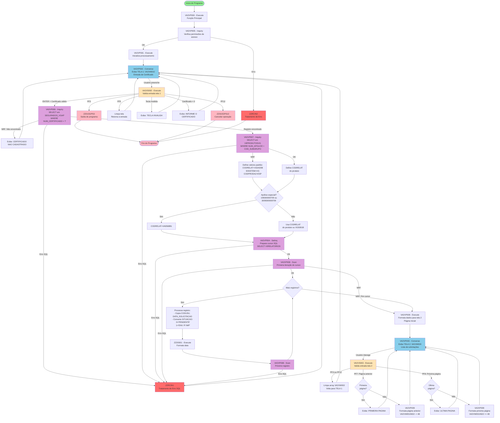

# Diagrama de Fluxo de Controle - VA2VA.ESF

## 📋 Visão Geral

**Programa:** VA2VA - Consulta de Relatórios de Certificados  
**Tipo:** Programa de consulta e listagem  
**Telas:** 2 mapas (VA2VM010 e VA2VM020)  
**Banco de Dados:** DB2 Mainframe  
**Sistema:** Administração Integrada de Seguros

---

## 🗺️ Diagrama de Fluxo Completo



---

## 📊 Análise Detalhada das Funções

### 🔵 Funções Principais (Execute)

#### VA2VP000 - Ponto de Entrada
- **Tipo:** Execute
- **Descrição:** Função principal do programa
- **Responsabilidades:**
  - Verificar permissões de acesso (chama VA2VP005)
  - Iniciar fluxo de processamento (chama VA2VP001)
  - Tratamento de erros com ZZRCIN2

#### VA2VP001 - Controlador de Fluxo
- **Tipo:** Execute
- **Descrição:** Controla o fluxo entre as duas telas
- **Responsabilidades:**
  - Chamar tela 1 (VA2VP002)
  - Chamar validações tela 1 (VA2VS002)
  - Chamar tela 2 (VA2VP003)
  - Chamar validações tela 2 (VA2VS003)

#### VA2VS002 - Validações Tela 1
- **Tipo:** Execute
- **Data:** 02/04/2019 18:43:30
- **Descrição:** TESTA PF - Validações da primeira tela
- **Responsabilidades:**
  1. **Tratamento de Teclas de Função:**
     - PF3 → ZZ01SGPS3() - Sair do programa
     - PF12 → ZZ01SGPS12() - Cancelar operação
     - PF5 → Limpar tela e retornar
     - Outras teclas → "TECLA INVALIDA"
  
  2. **Validação de Dados:**
     - Verifica se certificado foi informado
     - Consulta existência do certificado (VA2VP006)
     - Consulta dados do produto (VA2VP007)
  
  3. **Definição de Relatório:**
     - Verifica apólices especiais (109300000709, 3009300000709)
     - Define CODRELAT apropriado
  
  4. **Consulta de Histórico:**
     - Prepara cursor SQL (VA2VP004 - SetInq)
     - Itera registros (VA2VP008 - Scan)
     - Formata situação: 0='PENDENTE', 1='ENV. P/ IMP'
  
  5. **Exibição de Resultados:**
     - Formata dados para tela 2 (VA2VP009)
     - Define flag para exibir tela 2

#### VA2VS003 - Validações Tela 2
- **Tipo:** Execute
- **Data:** 11/21/2006 18:09:46
- **Descrição:** consiste mapa m010 - Validações da segunda tela
- **Responsabilidades:**
  1. **Navegação:**
     - PF3/PF12 → Volta para tela 1 (limpa array VA2VW002)
     - PF7 → Página anterior (decrementa 48 registros)
     - PF8 → Próxima página (incrementa 48 registros)
  
  2. **Controle de Paginação:**
     - Verifica limites (primeira/última página)
     - Exibe mensagens: "PRIMEIRA PAGINA", "ULTIMA PAGINA"
     - Reformata tela com VA2VP009

#### VA2VP009 - Formatação de Tela 2
- **Tipo:** Execute
- **Data:** 11/21/2006 17:57:31
- **Descrição:** Formata dados do array para exibição na tela 2
- **Responsabilidades:**
  - Limpa mapa VA2VM020
  - Copia certificado
  - Move dados do array VA2VW002 para campos da tela
  - Controla índice de paginação (VA2VW001IND2)
  - Incrementa índice por EZETST (tamanho da tela)

---

### 🟣 Funções de Tela (Converse)

#### VA2VP002 - Tela 1
- **Tipo:** Converse
- **Mapa:** VA2VM010
- **Data:** 11/21/2006 16:17:32
- **Descrição:** APRESENTA TELA DE INCLUSAO
- **Campos de Entrada:**
  - NUM_CERTIFICADO (campo principal)
- **Campos de Saída:**
  - NOMSIS, GRUFUC, MNUEMP (cabeçalho)
  - DATA, HORA (timestamp)
  - EZEMSG (mensagens)
- **Teclas de Função:**
  - PF3: Sair
  - PF5: Limpar
  - PF12: Cancelar
  - ENTER: Processar

#### VA2VP003 - Tela 2
- **Tipo:** Converse
- **Mapa:** VA2VM020
- **Data:** 11/21/2006 17:48:31
- **Descrição:** mostra mapa m010 - Lista de relatórios
- **Campos de Entrada:**
  - NUM_CERTIFICADO (read-only, vem da tela 1)
- **Campos de Saída:**
  - Grid 12x2 (24 registros/página):
    - DATA_SOLICITACAO
    - COD_USUARIO
    - SITUACAO
  - NOMSIS, GRUFUC, MNUEMP (cabeçalho)
  - DATA, HORA (timestamp)
  - EZEMSG (mensagens)
- **Teclas de Função:**
  - PF3/PF12: Voltar para tela 1
  - PF7: Página anterior
  - PF8: Próxima página

---

### 🟢 Funções de Banco de Dados

#### VA2VP005 - Verificação de Acesso
- **Tipo:** Inquiry (SELECT único)
- **Descrição:** Verifica permissões do usuário
- **Tratamento de Erro:** ZZRCIN2

#### VA2VP006 - Consulta Certificado
- **Tipo:** Inquiry (SELECT único)
- **Tabela:** SEGURADOS_VGAP
- **SQL:** `SELECT * FROM SEGURADOS_VGAP WHERE NUM_CERTIFICADO = ?`
- **Campos Retornados:**
  - NUM_CERTIFICADO
  - NUM_APOLICE
  - COD_SUBGRUPO
- **Tratamento de Erro:** ZZRCIN1
- **Mensagem NRF:** "CERTIFICADO NAO CADASTRADO"

#### VA2VP007 - Consulta Produto
- **Tipo:** Inquiry (SELECT único)
- **Tabela:** V0PRODUTOSVG
- **SQL:** 
  ```sql
  SELECT * FROM V0PRODUTOSVG 
  WHERE NUM_APOLICE = ? 
    AND CODSUBES = ?
  ```
- **Campos Retornados:**
  - CODRELAT (código do relatório)
  - IDSISTEM
  - CODPRODAZ
- **Tratamento de Erro:** ZZRCIN1
- **Defaults (se NRF):**
  - CODRELAT = 'VG0420B'
  - IDSISTEM = 'VG'
  - CODPRODAZ = 'ESP'

#### VA2VP004 - Preparação de Consulta Múltipla
- **Tipo:** SetInq (Preparação de cursor)
- **Tabela:** V0RELATORIOS
- **SQL:** 
  ```sql
  SELECT * FROM V0RELATORIOS 
  WHERE NRCERTIF = ? 
    AND CODRELAT = ?
  ORDER BY DATA_SOLICITACAO DESC
  ```
- **Tratamento de Erro:** ZZRCIN1

#### VA2VP008 - Iteração de Resultados
- **Tipo:** Scan (Iteração em cursor)
- **Descrição:** Percorre registros do cursor aberto por VA2VP004
- **Campos Processados:**
  - CODUSU → VA2VW002.VA2VW002CODUSU[i]
  - DATA_SOLICITACAO → VA2VW002.VA2VW002DTSOLIC[i]
  - SITUACAO → VA2VW002.VA2VW002SIT[i]
    - '0' → 'PENDENTE'
    - '1' → 'ENV. P/ IMP'
- **Tratamento de Erro:** ZZRCIN1
- **Função Auxiliar:** ZZ20S01 (formatação de data)

---

### 🔴 Funções de Tratamento de Erro

#### ZZRCIN1
- **Tipo:** Error Handling Function Execute
- **Contexto:** Erros de banco de dados (SQL)
- **Usado por:**
  - VA2VP006 (Inquiry Certificado)
  - VA2VP007 (Inquiry Produto)
  - VA2VP004 (SetInq)
  - VA2VP008 (Scan)

#### ZZRCIN2
- **Tipo:** Error Handling Function Execute
- **Contexto:** Erros de acesso/permissão
- **Usado por:**
  - VA2VP005 (Verificação de acesso)

---

### ⚙️ Funções de Sistema Utilitárias

#### ZZ01SGPS3
- **Tipo:** Execute
- **Descrição:** Rotina de saída do programa (PF3)
- **Contexto:** Chamado quando usuário pressiona PF3

#### ZZ01SGPS12
- **Tipo:** Execute
- **Descrição:** Rotina de cancelamento (PF12)
- **Contexto:** Chamado quando usuário pressiona PF12

#### ZZ20S01
- **Tipo:** Execute
- **Descrição:** Formatação de data
- **Contexto:** Usado no loop de processamento de registros

---

## 📦 Estruturas de Dados Principais

### Arrays e Work Areas

#### VA2VW001
- **Tipo:** Work Storage
- **Campos:**
  - `W01A0035` - Flag de controle ("MOSTRA A TELA M10" / "MOSTRA A TELA M20")
  - `VA2VW001IND` - Índice para loop de registros
  - `VA2VW001IND2` - Índice para paginação

#### VA2VW002
- **Tipo:** Array (ocorre múltiplas vezes)
- **Campos:**
  - `VA2VW002CODUSU[]` - Códigos de usuário
  - `VA2VW002DTSOLIC[]` - Datas de solicitação
  - `VA2VW002SIT[]` - Situações

### Tabelas SQL

#### SEGURADOS_VGAP
- **Campos:**
  - NUM_CERTIFICADO (PK)
  - NUM_APOLICE
  - COD_SUBGRUPO

#### V0PRODUTOSVG
- **Campos:**
  - NUM_APOLICE (PK)
  - CODSUBES (PK)
  - CODRELAT
  - IDSISTEM
  - CODPRODAZ

#### V0RELATORIOS
- **Campos:**
  - NRCERTIF
  - CODRELAT
  - CODUSU
  - DATA_SOLICITACAO
  - SITUACAO ('0'=Pendente, '1'=Enviado p/ Impressão)

---

## 🎯 Regras de Negócio Identificadas

### 1. Validação de Certificado
- Certificado é obrigatório
- Deve existir na tabela SEGURADOS_VGAP
- Relacionamento: Certificado → Apólice → Produto

### 2. Seleção de Relatório
- **Regra Padrão:** Usa CODRELAT do produto (V0PRODUTOSVG)
- **Se produto não tem CODRELAT:** Usa 'VG5001B'
- **Apólices Especiais:** 109300000709 ou 3009300000709 → Usa 'VA0568B1'
- **Se produto não encontrado:** Usa 'VG0420B' (Relatório ESP)

### 3. Situação dos Relatórios
- **0** → "PENDENTE" (Aguardando processamento)
- **1** → "ENV. P/ IMP" (Enviado para impressão)

### 4. Paginação
- **24 registros por página** (12 linhas x 2 colunas)
- **PF7:** Retrocede 48 registros (2 páginas de dados internos)
- **PF8:** Avança 48 registros
- Controle de limites com mensagens apropriadas

### 5. Navegação entre Telas
- **Tela 1 → Tela 2:** Após validações bem-sucedidas e ENTER
- **Tela 2 → Tela 1:** PF3 ou PF12 (com limpeza de dados)
- **Saída do Programa:** PF3 na tela 1

---

## 🔄 Fluxo de Dados

### Entrada do Usuário
```
Tela 1 (VA2VM010)
    ↓
NUM_CERTIFICADO
    ↓
Validações (VA2VS002)
    ↓
Consultas SQL (VA2VP006, VA2VP007, VA2VP004)
    ↓
Array VA2VW002 (dados temporários)
    ↓
Formatação (VA2VP009)
    ↓
Tela 2 (VA2VM020)
```

### Paginação na Tela 2
```
PF7: VA2VW001IND2 -= 48
    ↓
VA2VP009 (reformata)
    ↓
VA2VM020 (exibe)

PF8: VA2VW001IND2 += 48
    ↓
VA2VP009 (reformata)
    ↓
VA2VM020 (exibe)
```

---

## 🔧 Pontos de Atenção para Migração

### 1. Gestão de Estado
- **Mainframe:** Estado mantido entre conversas (CONVERSE)
- **Modernização:** Precisa de gestão de sessão ou state em backend

### 2. Paginação
- **Mainframe:** Array em memória + índice manual
- **Modernização:** LIMIT/OFFSET no SQL ou cursor paginado

### 3. Tratamento de Teclas de Função
- **PF3, PF5, PF7, PF8, PF12:** Mapear para botões/ações REST
- **ENTER:** Submissão de formulário

### 4. Mensagens de Erro
- **EZEMSG:** Campo de mensagem na tela
- **Modernização:** Array de mensagens em response JSON

### 5. Campos Protegidos/Brightened
- **SET BRIGHT:** Destacar campos com erro
- **Modernização:** Validação client-side + marcadores visuais

### 6. Apólices Especiais Hard-coded
- **109300000709, 3009300000709:** Migrar para tabela de configuração

---

## 📋 Checklist de Conversão

### Backend (FastAPI)

- [ ] **Endpoint 1:** GET `/api/v1/certificados/{num_certificado}`
  - Consulta VA2VP006 (SEGURADOS_VGAP)
  - Retorna dados básicos do certificado

- [ ] **Endpoint 2:** GET `/api/v1/certificados/{num_certificado}/produto`
  - Consulta VA2VP007 (V0PRODUTOSVG)
  - Retorna dados do produto associado

- [ ] **Endpoint 3:** GET `/api/v1/certificados/{num_certificado}/relatorios`
  - Consulta VA2VP004+VA2VP008 (V0RELATORIOS)
  - Paginação: `?page=1&page_size=24`
  - Retorna lista de solicitações de relatórios

- [ ] **Service Layer:**
  - `CertificadoService.get_by_numero()`
  - `CertificadoService.get_produto()`
  - `CertificadoService.get_relatorios(page, page_size)`
  - `CertificadoService.validate_certificado()`

- [ ] **Repository Layer:**
  - `CertificadoRepository.find_by_numero()`
  - `ProdutoRepository.find_by_apolice_subgrupo()`
  - `RelatorioRepository.find_by_certificado_paged()`

- [ ] **Business Rules:**
  - Validação de certificado obrigatório
  - Lógica de seleção de CODRELAT
  - Conversão de situação (0→PENDENTE, 1→ENV. P/ IMP)
  - Tratamento de apólices especiais

### Frontend (React/Vue)

- [ ] **Tela 1:** Formulário de busca
  - Input: NUM_CERTIFICADO
  - Botão: Consultar (ENTER)
  - Botões: Limpar (PF5), Sair (PF3), Cancelar (PF12)

- [ ] **Tela 2:** Grid de resultados
  - Tabela com 3 colunas: Data, Usuário, Situação
  - Paginação: Anterior (PF7), Próxima (PF8)
  - Botões: Voltar (PF3/PF12)

- [ ] **Validações Client-Side:**
  - Certificado obrigatório
  - Formato numérico
  - Feedback visual de erros

### Testes

- [ ] Teste unitário: Validação de certificado
- [ ] Teste unitário: Lógica de seleção de relatório
- [ ] Teste integração: Consulta completa (end-to-end)
- [ ] Teste integração: Paginação
- [ ] Teste E2E: Fluxo usuário completo

---

## 📝 Notas Técnicas

### Performance
- A consulta VA2VP004 busca TODOS os relatórios de um certificado em memória
- Considerar paginação no SQL para grandes volumes
- Índices recomendados:
  - `SEGURADOS_VGAP(NUM_CERTIFICADO)`
  - `V0PRODUTOSVG(NUM_APOLICE, CODSUBES)`
  - `V0RELATORIOS(NRCERTIF, CODRELAT, DATA_SOLICITACAO DESC)`

### Segurança
- VA2VP005 verifica permissões - implementar autorização no backend
- Validar entrada do usuário para evitar SQL injection
- Implementar rate limiting nos endpoints

### Manutenibilidade
- Hard-coded apólices especiais devem ser parametrizadas
- Códigos de situação ('0', '1') devem estar em enum/constantes
- Códigos de relatório default devem ser configuráveis

---

## 🎓 Conclusão

O programa **VA2VA** é um exemplo clássico de aplicação mainframe de consulta com:
- **2 telas interativas** (busca → listagem)
- **3 consultas SQL** (certificado, produto, relatórios)
- **Paginação manual** de resultados
- **Regras de negócio** para seleção de relatórios
- **Navegação por teclas de função**

A migração para arquitetura moderna exige:
- **Backend REST** stateless com paginação SQL
- **Frontend SPA** com gestão de estado client-side
- **Validações** tanto em backend quanto frontend
- **Parametrização** de regras hard-coded

---

**Documento gerado automaticamente via vamap.exe**  
**Data:** 04/12/2025  
**Arquivo analisado:** `_LEGADO\va2va.esf`

