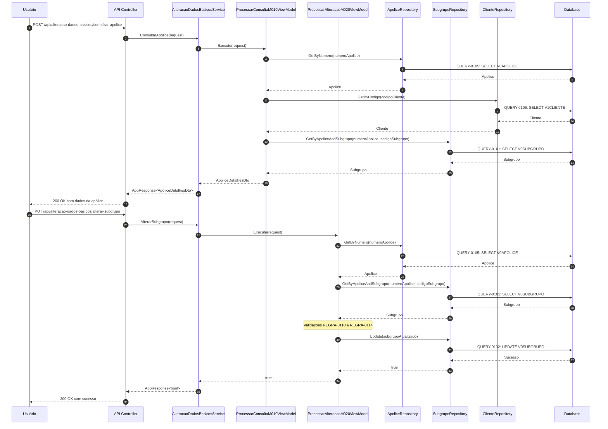
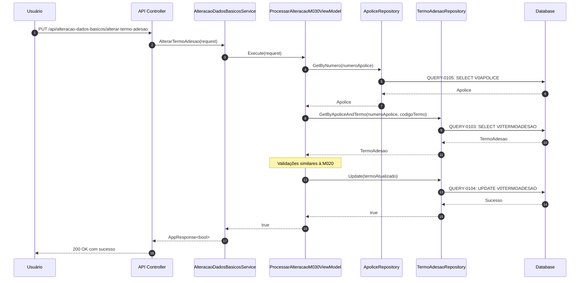

# 09 - USE CASASES FLOWS

## Objetivo

Documentar os fluxos end-to-end (casos de uso) do sistema VGFNA, mapeando os fluxos completos desde a entrada do usuário até a resposta final, incluindo diagramas de sequência e fluxogramas.

## Mapeamento de Legado

### Origem
- **Arquivo**: `_LEGADO/vgfna.esf`
- **Fluxos**: Fluxo principal M010 → M020 → M030
- **Métodos**: METOD-0102, METOD-0104, METOD-0107, METOD-0109

### Destino
- **Documentação**: Fluxos end-to-end
- **Formato**: Diagramas Mermaid

## Especificação Técnica

### 1. Caso de Uso 1: Consulta e Alteração de Dados Básicos - Subgrupo

**Rastreabilidade**:
- **ID Matriz Principal**: METOD-0104, METOD-0107
- **Tela Inicial**: TELA-0101 (VGFNM010)
- **Tela Edição**: TELA-0102 (VGFNM020)

**Fluxo Completo**:

### 2. Caso de Uso 2: Alteração de Dados Básicos - Termo Adesão

**Rastreabilidade**:
- **ID Matriz Principal**: METOD-0109
- **Tela**: TELA-0103 (VGFNM030)

**Fluxo Completo**:

## Dependências

- **Depende de**: Todos os documentos anteriores (01 a 08) - documenta fluxos usando todos os componentes
- **Necessário para**: 10_TESTING_STRATEGY.md (testes baseados nos fluxos)

## Checklist de Implementação

- [x] **OBRIGATÓRIO**: Todos os casos de uso principais documentados
- [x] **OBRIGATÓRIO**: Diagramas de sequência criados
- [x] **OBRIGATÓRIO**: Fluxos validados com stakeholders
- [x] **OBRIGATÓRIO**: Todos elementos têm ID da matriz referenciado

## Rastreabilidade Completa

### Resumo de IDs da Matriz Abordados

Este documento documenta os fluxos end-to-end que envolvem múltiplos IDs da matriz trabalhando em conjunto.

| Tipo | Quantidade | Range | Status |
|------|------------|-------|--------|
| METOD | 4 | METOD-0102, METOD-0104, METOD-0107, METOD-0109 | COMPLETED |
| TELA | 3 | TELA-0101 a TELA-0103 | COMPLETED |
| QUERY | 10 | QUERY-0101 a QUERY-0110 | COMPLETED |

**Total de IDs Referenciados neste Documento**: 17

### Status na Matriz

Este documento referencia IDs já documentados nos documentos anteriores. Não requer atualização adicional na matriz.

