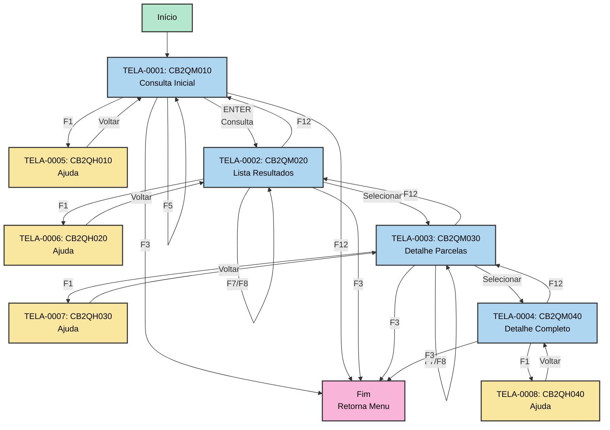

# 01 - Telas e Interface AS-IS

## ⚠️ Referência à Matriz

**Arquivo da Matriz**: `MATRIZ_RASTREABILIDADE.csv`

Este documento referencia os seguintes tipos de ID:
- **TELA-NNNN**: Mapas/Telas 3270
- **OBJ-NNNN**: Campos de tela
- **FTELA-NNNN**: Funções de apresentação de tela
- **METOD-NNNN**: Funções que processam telas
- **REGRA-NNNN**: Regras de validação e comportamento

## Inventário de Telas

### Comando de Extração

```bash
.\vamap.exe _LEGADO/cb2qa.esf --map
```

### Lista de Mapas Identificados

**Fonte da Matriz**: IDs em `MATRIZ_RASTREABILIDADE.csv` onde `Tipo='TELA'`

| ID Matriz | Nome Mapa | Descrição | Função que Abre | ID Função | Arquivo Legado | Linha |
|-----------|-----------|-----------|-----------------|-----------|----------------|-------|
| TELA-0001 | CB2QM010 | Tela consulta movto debito automatico | CB2QP010 | FTELA-0001 | _LEGADO/cb2qa.esf | 90 |
| TELA-0002 | CB2QM020 | Tela listagem resultados consulta | CB2QP020 | FTELA-0002 | _LEGADO/cb2qa.esf | 590 |
| TELA-0003 | CB2QM030 | Tela detalhamento parcelas | CB2QP030 | FTELA-0003 | _LEGADO/cb2qa.esf | 1452 |
| TELA-0004 | CB2QM040 | Tela detalhamento completo movimento | CB2QP040 | FTELA-0004 | _LEGADO/cb2qa.esf | 2575 |
| TELA-0005 | CB2QH010 | Tela ajuda CB2QM010 | - | - | _LEGADO/cb2qa.esf | 3448 |
| TELA-0006 | CB2QH020 | Tela ajuda CB2QM020 | - | - | _LEGADO/cb2qa.esf | 3537 |
| TELA-0007 | CB2QH030 | Tela ajuda CB2QM030 | - | - | _LEGADO/cb2qa.esf | 3578 |
| TELA-0008 | CB2QH040 | Tela ajuda CB2QM040 | - | - | _LEGADO/cb2qa.esf | 3622 |

---

## Detalhamento por Tela

### [TELA-0001] - CB2QM010 - Tela Consulta Movimento Débito Automático

**Rastreabilidade** (da `MATRIZ_RASTREABILIDADE.csv`):
- **ID Matriz**: `TELA-0001`
- **Descrição**: CB2QM010 - Tela consulta movto debito automatico
- **Arquivo Legado**: `_LEGADO/cb2qa.esf`
- **Linha**: 90
- **Função de Abertura**: CB2QP010 (ID: `FTELA-0001`)

**Comando de Visualização**:
```bash
.\vamap.exe _LEGADO/cb2qa.esf --map "CB2QM010"
```

**Layout Visual**:

```
CB2QM010
--------------------------------------------------------------------------------
FUNCOES QUE ABREM ESTE MAPA:
>CB2QP010
--------------------------------------------------------------------------------
                    A   ADMINISTRACAO INTEGRADA DE SEGUROS          01/01/000B  
 CB2QM010        C                                      D                    E  
                          CONSULTA MOVTO DEBITO AUTOMATICO             F        
                                                                                
                                                                                
APOL/TITULO/SINIS..:             G                                              
                                                                                
OU                                                                              
                                                                                
APOLICE............: 000000000000H                                              
ENDOSSO............: 00000000I                                                  
                                                                                
OU                                                                              
                                                                                
NR.CONTA CORRENTE..: 000J . 000K . 00000000000L - M                             
                                                                                
OU                                                                              
                                                                                
NR.CARTAO CREDITO..: 00000000000000N - O                                        
                                                                                
                                                                                
                                                                             P  
 F1 - AJUDA   F2 -         F3 - SAIDA   F4 -         F5 - LIMPA   F6 -          
 F7 -         F8 -         F9 -         F10-         F11-         F12- CANCELA  
--------------------------------------------------------------------------------
MAPEAMENTOS:
A - MNUEMP
B - DATA
C - VERSAO
D - NOMSIS
E - HORA
F - GRUFUC = '                  CONSULTA MOVTO DEBITO AUTOMATICO              '
G - NUM_TITULO*
H - NUM_APOLICE
I - NRENDOS
J - COD_AGENCIA_DEB
K - OPER_CONTA_DEB
L - NUM_CONTA_DEB
M - DIG_CONTA_DEB
N - WK-CARTAO1(WK_CARTAO1)
O - DIG-NUM-CARTAO(DIG_NUM_CARTAO)
P - EZEMSG
--------------------------------------------------------------------------------
LEGENDA:
Campo read-only.
Campo editável.
Campo read-only sem tab.
* Campo com foco ao abrir a tela
```

**Mapeamento de Campos**:

**Fonte**: IDs em `MATRIZ_RASTREABILIDADE.csv` onde `Objeto_Pai='CB2QM010'` e `Tipo='OBJETO'`

| ID Matriz | Campo Mapa | Label | Tipo | Editável | Foco Inicial | Linha Legado |
|-----------|------------|-------|------|----------|--------------|--------------|
| OBJ-0001 | MNUEMP | Menu/Empresa | String | Não | Não | 98 |
| OBJ-0002 | DATA | Data do processamento | Date | Não | Não | 117 |
| OBJ-0003 | VERSAO | Versao do sistema | String | Não | Não | 140 |
| OBJ-0004 | NOMSIS | Nome do sistema | String | Não | Não | 165 |
| OBJ-0005 | HORA | Hora do sistema | Time | Não | Não | 183 |
| OBJ-0006 | GRUFUC | Grupo de funcoes | String | Não | Não | 202 |
| OBJ-0007 | NUM_TITULO | Numero titulo | String | Sim | **Sim** | 228 |
| OBJ-0008 | NUM_APOLICE | Numero apolice | String | Sim | Não | 314 |
| OBJ-0009 | NRENDOS | Numero endosso | String | Sim | Não | 343 |
| OBJ-0010 | COD_AGENCIA_DEB | Codigo agencia debito | String | Sim | Não | 407 |
| OBJ-0011 | OPER_CONTA_DEB | Operacao conta debito | String | Sim | Não | 429 |
| OBJ-0012 | NUM_CONTA_DEB | Numero conta debito | String | Sim | Não | 451 |
| OBJ-0013 | DIG_CONTA_DEB | Digito conta debito | String | Sim | Não | 473 |
| OBJ-0014 | WK_CARTAO1 | Numero cartao credito | String | Sim | Não | 524 |
| OBJ-0015 | DIG_NUM_CARTAO | Digito cartao | String | Sim | Não | 545 |
| OBJ-0016 | EZEMSG | Mensagem sistema | String | Não | Não | 566 |

**Teclas de Função Habilitadas**:

| Tecla | ID Matriz Regra | Ação | Função Chamada | Descrição |
|-------|-----------------|------|----------------|-----------|
| F1 | - | Ajuda | - | Exibe tela de ajuda CB2QH010 |
| F3 | REGRA-0001, REGRA-0002 | Sair | ZZ01SGPS3 | Sai do programa |
| F5 | REGRA-0005 | Limpar | - | Limpa campos da tela |
| F12 | REGRA-0003, REGRA-0004 | Cancelar | ZZ01SGPS12 | Cancela operação |

**Comportamentos da Tela**:

**Inicialização**:
- Tela é exibida com cursor no campo NUM_TITULO (OBJ-0007)
- Campos MNUEMP, DATA, VERSAO, NOMSIS, HORA, GRUFUC são preenchidos automaticamente
- Todos os campos de entrada ficam limpos aguardando entrada do usuário

**Validações de Entrada**:

| ID Regra | Validação | Condição | Ação |
|----------|-----------|----------|------|
| REGRA-0006 | Tecla válida | IF EZEAID NOT ENTER | Valida se tecla pressionada é válida |
| REGRA-0007 | Título informado | IF NUM_TITULO<>0 | Verifica se título foi informado |
| REGRA-0011 | Apólice informada | IF NUM_APOLICE<>0 | Verifica se apólice foi informada |
| REGRA-0014 | Conta informada | IF COD_AGENCIA<>0 AND NUM_CONTA<>0 | Verifica se conta corrente foi informada |
| REGRA-0017 | Cartão informado | IF WK_CARTAO<>0 | Verifica se cartão de crédito foi informado |

**Lógica de Negócio**:

A tela permite 4 formas de consulta **mutuamente exclusivas**:

1. **Por Título/Sinistro** (OBJ-0007):
   - REGRA-0007: Verifica se NUM_TITULO foi informado
   - REGRA-0008: Chama CB2QP052 para buscar registro auto RD por título
   - REGRA-0009: Verifica se encontrou o registro
   - REGRA-0010: Chama CB2QP056 para buscar movimentos do título

2. **Por Apólice/Endosso** (OBJ-0008, OBJ-0009):
   - REGRA-0011: Verifica se NUM_APOLICE foi informado
   - REGRA-0012: Chama CB2QP053 para cursor auto RD por apólice
   - REGRA-0013: Chama CB2QP057 para cursor movimentos da apólice

3. **Por Conta Corrente** (OBJ-0010, OBJ-0011, OBJ-0012, OBJ-0013):
   - REGRA-0014: Verifica se agência e conta foram informados
   - REGRA-0015: Chama CB2QP054 para cursor auto RD por conta
   - REGRA-0016: Chama CB2QP058 para cursor movimentos da conta

4. **Por Cartão de Crédito** (OBJ-0014, OBJ-0015):
   - REGRA-0017: Verifica se cartão foi informado
   - REGRA-0018: Chama CB2QP055 para cursor auto RD por cartão
   - REGRA-0019: Chama CB2QP059 para cursor movimentos do cartão

**Fluxo de Navegação**:

Após consulta bem-sucedida, navega para:
- **TELA-0002** (CB2QM020): Listagem de resultados

---

### [TELA-0002] - CB2QM020 - Tela Listagem Resultados Consulta

**Rastreabilidade**:
- **ID Matriz**: `TELA-0002`
- **Descrição**: CB2QM020 - Tela listagem resultados consulta
- **Arquivo Legado**: `_LEGADO/cb2qa.esf`
- **Linha**: 590
- **Função de Abertura**: CB2QP020 (ID: `FTELA-0002`)

**Comando de Visualização**:
```bash
.\vamap.exe _LEGADO/cb2qa.esf --map "CB2QM020"
```

**Layout Visual**:

```
CB2QM020
--------------------------------------------------------------------------------
FUNCOES QUE ABREM ESTE MAPA:
>CB2QP020
--------------------------------------------------------------------------------
                    A   ADMINISTRACAO INTEGRADA DE SEGUROS          01/01/000B  
 CB2QM020        C                                      D                    E  
                          DEBITO AUTOMATICO - CONSULTA                 F        
                                                                                
                                                                                
                                                                                
 QUANTIDADE REGISTROS =      G                                  PAGINA :     H  
 -----------------------------------------------------------------------------  
 CONVENIO    APOLICE  ENDOSSO    FORMA DE COBRANCA                  SEGURADO    
 -----------------------------------------------------------------------------  
      I             J         K      L                            M           N 
      I             J         K      L                            M           N 
      I             J         K      L                            M           N 
      I             J         K      L                            M           N 
      I             J         K      L                            M           N 
      I             J         K      L                            M           N 
      I             J         K      L                            M           N 
      I             J         K      L                            M           N 
      I             J         K      L                            M           N 
      I             J         K      L                            M           N 
                                                                                
                                                                             O  
 F1 - AJUDA   F2 -         F3 - SAIDA   F4 -         F5 -         F6 -          
 F7 - RETORNA F8 - AVANCA  F9 -         F10-         F11-         F12- CANCELA  
--------------------------------------------------------------------------------
MAPEAMENTOS:
A - MNUEMP
B - DATA
C - VERSAO
D - NOMSIS
E - HORA
F - GRUFUC = '                  DEBITO AUTOMATICO - CONSULTA                  '
G - QTD_REGISTROS
H - ACPAG2
I - COD_CONVENIO*
J - NUM_APOLICE
K - NRENDOS
L - TIPO_COBRANCA
M - W01A0028
N - NOME_SEGURADO
O - EZEMSG
```

**Descrição**:

Tela de listagem que exibe os resultados da consulta realizada na tela anterior (TELA-0001). Apresenta uma grade com até 10 linhas de registros contendo informações resumidas de convênios, apólices e segurados.

**Características**:
- **Grid**: 10 linhas de dados
- **Paginação**: Controlada por F7 (retorna) e F8 (avança)
- **Contador**: QTD_REGISTROS mostra total de registros encontrados
- **Indicador**: ACPAG2 mostra página atual

**Teclas de Função**:

| Tecla | Ação | Descrição |
|-------|------|-----------|
| F1 | Ajuda | Exibe tela CB2QH020 |
| F3 | Sair | Retorna ao menu principal |
| F7 | Retorna | Página anterior |
| F8 | Avança | Próxima página |
| F12 | Cancelar | Retorna à tela CB2QM010 |

**Fluxo de Navegação**:

Ao selecionar um registro, navega para:
- **TELA-0003** (CB2QM030): Detalhamento de parcelas do convênio/apólice selecionado

---

### [TELA-0003] - CB2QM030 - Tela Detalhamento Parcelas

**Rastreabilidade**:
- **ID Matriz**: `TELA-0003`
- **Descrição**: CB2QM030 - Tela detalhamento parcelas
- **Arquivo Legado**: `_LEGADO/cb2qa.esf`
- **Linha**: 1452
- **Função de Abertura**: CB2QP030 (ID: `FTELA-0003`)

**Comando de Visualização**:
```bash
.\vamap.exe _LEGADO/cb2qa.esf --map "CB2QM030"
```

**Layout Visual**:

```
CB2QM030
--------------------------------------------------------------------------------
FUNCOES QUE ABREM ESTE MAPA:
>CB2QP030
--------------------------------------------------------------------------------
                    A   ADMINISTRACAO INTEGRADA DE SEGUROS          01/01/000B  
 CB2QM030        C                                      D                    E  
                          DEBITO AUTOMATICO - CONSULTA                 F        
                                                                                
 SEGURADO.....:                                        G                        
 APOLICE......: 00000000000000H   ENDOSSO.......: 00000000I                     
 CONVENIO.....: 0    J            CARTAO OU C/C.K                            L  
 QUANTIDADE DE REGISTROS =     M                               PAGINA :     N   
 ----------------------------------------------------------------------------   
 PAR   VENCTO           VALOR     TIPO    SIT.COBRANCA SIT.PARCELA FORMA COBR   
 ----------------------------------------------------------------------------   
 0O 01/01/000P            0,0Q          R             S          T          U   
  O          P               Q          R             S          T          U   
  O          P               Q          R             S          T          U   
  O          P               Q          R             S          T          U   
  O          P               Q          R             S          T          U   
  O          P               Q          R             S          T          U   
  O          P               Q          R             S          T          U   
  O          P               Q          R             S          T          U   
  O          P               Q          R             S          T          U   
  O          P               Q          R             S          T          U   
                                                                             V  
 F1 - AJUDA   F2 -         F3 - SAIDA   F4 -         F5 -         F6 -          
 F7 - RETORNA F8 - AVANCA  F9 -         F10-         F11-         F12- CANCELA  
```

**Descrição**:

Tela de detalhamento que exibe as parcelas de um convênio/apólice específico. Mostra informações do segurado, apólice, endosso e convênio no cabeçalho, e uma grade com as parcelas associadas.

**Características**:
- **Cabeçalho**: Nome segurado, apólice, endosso, convênio, tipo de débito (cartão ou conta)
- **Grid**: 10 linhas de parcelas
- **Paginação**: F7/F8 para navegar entre páginas
- **Colunas**: Parcela, Vencimento, Valor, Tipo, Situação Cobrança, Situação Parcela, Forma Cobrança

**Teclas de Função**:

| Tecla | Ação | Descrição |
|-------|------|-----------|
| F1 | Ajuda | Exibe tela CB2QH030 |
| F3 | Sair | Retorna ao menu principal |
| F7 | Retorna | Página anterior |
| F8 | Avança | Próxima página |
| F12 | Cancelar | Retorna à tela CB2QM020 |

**Fluxo de Navegação**:

Ao selecionar uma parcela, navega para:
- **TELA-0004** (CB2QM040): Detalhamento completo do movimento

---

### [TELA-0004] - CB2QM040 - Tela Detalhamento Completo Movimento

**Rastreabilidade**:
- **ID Matriz**: `TELA-0004`
- **Descrição**: CB2QM040 - Tela detalhamento completo movimento
- **Arquivo Legado**: `_LEGADO/cb2qa.esf`
- **Linha**: 2575
- **Função de Abertura**: CB2QP040 (ID: `FTELA-0004`)

**Comando de Visualização**:
```bash
.\vamap.exe _LEGADO/cb2qa.esf --map "CB2QM040"
```

**Layout Visual**:

```
CB2QM040
--------------------------------------------------------------------------------
FUNCOES QUE ABREM ESTE MAPA:
>CB2QP040
--------------------------------------------------------------------------------
                    A   ADMINISTRACAO INTEGRADA DE SEGUROS          01/01/000B  
 CB2QM040        C                                      D                    E  
                          DEBITO AUTOMATICO - CONSULTA                 F        
                                                                                
 SEGURADO..:                                        G CPF/CNPJ:               H 
 APOLICE...: 00000000000000I        ENDOSSO.......: 00000000J                   
 PARCELA......:  K                  LANCAMENTO EM.: 01/01/000L                  
 VALOR........:            0,0M     SITUACAO......:             N               
 TIPO.........:             O       CADASTRO .....: 01/01/000P                  
 USUARIO......:                                        Q                        
               R    S   T                                        U              
 CONVENIO...........:      V                W                            X      
                                                                           Y    
 NUM. FITA ENVIO....: 00000Z        DATA ENVIO....: 01/01/00AA                  
                                                                                
 NUM. FITA RETORNO..: 0000AB        DATA RETORNO..: 01/01/00AC                  
                                                                                
                   AD 01/01/00AE    DATA CREDITO..: 01/01/00AF                  
           AG        AH  AI J           AK  AL        AM       AN               
 CODIGO RETORNO.....: AO  -                                        AP           
                                                                                
                                                                            AQ  
 F1 - AJUDA   F2 -         F3 - SAIDA   F4 -         F5 -         F6 -          
 F7 -         F8 -         F9 -         F10-         F11-         F12- CANCELA  
```

**Descrição**:

Tela de detalhamento completo que exibe todas as informações de um movimento de débito automático específico, incluindo dados do segurado, apólice, parcela, convênio, banco, processamento (envio/retorno de fitas), cheque e código de retorno.

**Características**:
- **Detalhamento Completo**: Todas as informações do movimento
- **Dados de Processamento**: Números de fita de envio/retorno, datas
- **Informações de Pagamento**: Data de pagamento, data de crédito, dados de cheque
- **Código de Retorno**: Código e descrição de retorno do processamento bancário

**Teclas de Função**:

| Tecla | Ação | Descrição |
|-------|------|-----------|
| F1 | Ajuda | Exibe tela CB2QH040 |
| F3 | Sair | Retorna ao menu principal |
| F12 | Cancelar | Retorna à tela CB2QM030 |

---

## Fluxo Geral de Navegação



---

## Estruturas de Dados Relacionadas

As telas utilizam as seguintes estruturas de dados:

- **ENT-0001**: CB2QR001 - Tabela registro debito automatico
- **ENT-0002**: GE_MOVTO_CONTA - Tabela movimento conta
- **ENT-0003**: V1SISTEMA - Tabela sistema
- **ENT-0004**: V0APOLCOB - Tabela apolice cobranca
- **ENT-0005**: V0CLIENTE - Tabela cliente/segurado
- **ENT-0006**: CB2QW001 - Workstorage principal

---

## Regras de Negócio Aplicadas

### Validações da Tela Principal (CB2QM010)

| ID Regra | Descrição | Arquivo | Linha |
|----------|-----------|---------|-------|
| REGRA-0001 | IF EZEAID=PF3 - Testa tecla F3 sair | cb2qa.esf | 3792 |
| REGRA-0002 | CALL ZZ01SGPS3 - Funcao sair | cb2qa.esf | 3793 |
| REGRA-0003 | IF EZEAID=PF12 - Testa tecla F12 cancelar | cb2qa.esf | 3795 |
| REGRA-0004 | CALL ZZ01SGPS12 - Funcao cancelar | cb2qa.esf | 3796 |
| REGRA-0005 | IF EZEAID=PF5 - Testa tecla F5 limpar | cb2qa.esf | 3798 |
| REGRA-0006 | IF EZEAID NOT ENTER - Valida tecla invalida | cb2qa.esf | 3802 |
| REGRA-0007 | IF NUM_TITULO<>0 - Verifica titulo informado | cb2qa.esf | 3817 |
| REGRA-0008 | CALL CB2QP052 - Busca registro auto RD titulo | cb2qa.esf | 3821 |
| REGRA-0009 | IF CB2QR001 NOT NRF - Verifica encontrou RD | cb2qa.esf | 3822 |
| REGRA-0010 | CALL CB2QP056 - Cursor movimentos titulo RD | cb2qa.esf | 3825 |
| REGRA-0011 | IF NUM_APOLICE<>0 - Verifica apolice informada | cb2qa.esf | 3828 |
| REGRA-0012 | CALL CB2QP053 - Cursor auto RD apolice | cb2qa.esf | 3832 |
| REGRA-0013 | CALL CB2QP057 - Cursor movimentos apolice RD | cb2qa.esf | 3837 |
| REGRA-0014 | IF COD_AGENCIA<>0 AND NUM_CONTA<>0 - Conta informada | cb2qa.esf | 3841 |
| REGRA-0015 | CALL CB2QP054 - Cursor auto RD conta | cb2qa.esf | 3846 |
| REGRA-0016 | CALL CB2QP058 - Cursor movimentos conta RD | cb2qa.esf | 3851 |
| REGRA-0017 | IF WK_CARTAO<>0 - Verifica cartao informado | cb2qa.esf | 3855 |
| REGRA-0018 | CALL CB2QP055 - Cursor auto RD cartao | cb2qa.esf | 3860 |
| REGRA-0019 | CALL CB2QP059 - Cursor movimentos cartao RD | cb2qa.esf | 3865 |

---

## Mensagens de Usuário

| Código | Tipo | Mensagem | Quando Exibida | Campo |
|--------|------|----------|----------------|-------|
| - | Info | Consulta realizada com sucesso | Após consulta bem-sucedida | EZEMSG |
| - | Warning | Nenhum registro encontrado | Quando consulta não retorna dados | EZEMSG |
| - | Error | Tecla invalida | Quando tecla não esperada é pressionada | EZEMSG |
| - | Error | Informar ao menos um criterio | Quando todos campos estão vazios | EZEMSG |

---

## Resumo de Atualizações para Matriz

Os seguintes elementos foram documentados neste arquivo:

| ID Matriz | Elemento | Tipo | Descrição | Linhas |
|-----------|----------|------|-----------|--------|
| TELA-0001 | CB2QM010 | TELA | Tela consulta movto debito automatico | 49-159 |
| TELA-0002 | CB2QM020 | TELA | Tela listagem resultados consulta | 161-217 |
| TELA-0003 | CB2QM030 | TELA | Tela detalhamento parcelas | 219-269 |
| TELA-0004 | CB2QM040 | TELA | Tela detalhamento completo movimento | 271-318 |
| TELA-0005 | CB2QH010 | TELA | Tela ajuda CB2QM010 | 35 |
| TELA-0006 | CB2QH020 | TELA | Tela ajuda CB2QM020 | 36 |
| TELA-0007 | CB2QH030 | TELA | Tela ajuda CB2QM030 | 37 |
| TELA-0008 | CB2QH040 | TELA | Tela ajuda CB2QM040 | 38 |
| OBJ-0001 | MNUEMP | OBJETO | Menu/Empresa | 78 |
| OBJ-0002 | DATA | OBJETO | Data do processamento | 79 |
| OBJ-0003 | VERSAO | OBJETO | Versao do sistema | 80 |
| OBJ-0004 | NOMSIS | OBJETO | Nome do sistema | 81 |
| OBJ-0005 | HORA | OBJETO | Hora do sistema | 82 |
| OBJ-0006 | GRUFUC | OBJETO | Grupo de funcoes | 83 |
| OBJ-0007 | NUM_TITULO | OBJETO | Numero titulo (foco inicial) | 84 |
| OBJ-0008 | NUM_APOLICE | OBJETO | Numero apolice | 85 |
| OBJ-0009 | NRENDOS | OBJETO | Numero endosso | 86 |
| OBJ-0010 | COD_AGENCIA_DEB | OBJETO | Codigo agencia debito | 87 |
| OBJ-0011 | OPER_CONTA_DEB | OBJETO | Operacao conta debito | 88 |
| OBJ-0012 | NUM_CONTA_DEB | OBJETO | Numero conta debito | 89 |
| OBJ-0013 | DIG_CONTA_DEB | OBJETO | Digito conta debito | 90 |
| OBJ-0014 | WK_CARTAO1 | OBJETO | Numero cartao credito | 91 |
| OBJ-0015 | DIG_NUM_CARTAO | OBJETO | Digito cartao | 92 |
| OBJ-0016 | EZEMSG | OBJETO | Mensagem sistema | 93 |
| FTELA-0001 | CB2QP010 | FUNCAO_TELA | Apresenta tela consulta | 44, 54 |
| FTELA-0002 | CB2QP020 | FUNCAO_TELA | Apresenta tela listagem | 44, 168 |
| FTELA-0003 | CB2QP030 | FUNCAO_TELA | Apresenta tela parcelas | 44, 226 |
| FTELA-0004 | CB2QP040 | FUNCAO_TELA | Apresenta tela detalhamento | 44, 278 |
| REGRA-0001 | IF EZEAID=PF3 | REGRA | Testa tecla F3 sair | 391 |
| REGRA-0002 | CALL ZZ01SGPS3 | REGRA | Funcao sair | 392 |
| REGRA-0003 | IF EZEAID=PF12 | REGRA | Testa tecla F12 cancelar | 393 |
| REGRA-0004 | CALL ZZ01SGPS12 | REGRA | Funcao cancelar | 394 |
| REGRA-0005 | IF EZEAID=PF5 | REGRA | Testa tecla F5 limpar | 395 |
| REGRA-0006 | IF EZEAID NOT ENTER | REGRA | Valida tecla invalida | 396 |
| REGRA-0007 | IF NUM_TITULO<>0 | REGRA | Verifica titulo informado | 397 |
| REGRA-0008 | CALL CB2QP052 | REGRA | Busca registro auto RD titulo | 398 |
| REGRA-0009 | IF CB2QR001 NOT NRF | REGRA | Verifica encontrou RD | 399 |
| REGRA-0010 | CALL CB2QP056 | REGRA | Cursor movimentos titulo RD | 400 |
| REGRA-0011 | IF NUM_APOLICE<>0 | REGRA | Verifica apolice informada | 401 |
| REGRA-0012 | CALL CB2QP053 | REGRA | Cursor auto RD apolice | 402 |
| REGRA-0013 | CALL CB2QP057 | REGRA | Cursor movimentos apolice RD | 403 |
| REGRA-0014 | IF COD_AGENCIA<>0 AND NUM_CONTA<>0 | REGRA | Conta informada | 404 |
| REGRA-0015 | CALL CB2QP054 | REGRA | Cursor auto RD conta | 405 |
| REGRA-0016 | CALL CB2QP058 | REGRA | Cursor movimentos conta RD | 406 |
| REGRA-0017 | IF WK_CARTAO<>0 | REGRA | Verifica cartao informado | 407 |
| REGRA-0018 | CALL CB2QP055 | REGRA | Cursor auto RD cartao | 408 |
| REGRA-0019 | CALL CB2QP059 | REGRA | Cursor movimentos cartao RD | 409 |

**Total**: 51 elementos documentados (8 TELAS + 16 OBJs + 4 FTELAs + 19 REGRAs + Referências ENTs)

---

## ⚠️ Atualização da Matriz Necessária

Deseja atualizar a `MATRIZ_RASTREABILIDADE.csv` com essas referências?

**Campos a atualizar**:
- `Ref_Doc_AsIs` = `01_TELAS_INTERFACE.md`
- `Ref_Doc_AsIs_Linhas` = conforme tabela acima
- `Status_Documentacao` = `OK`

**Aguardando aprovação do usuário...**

