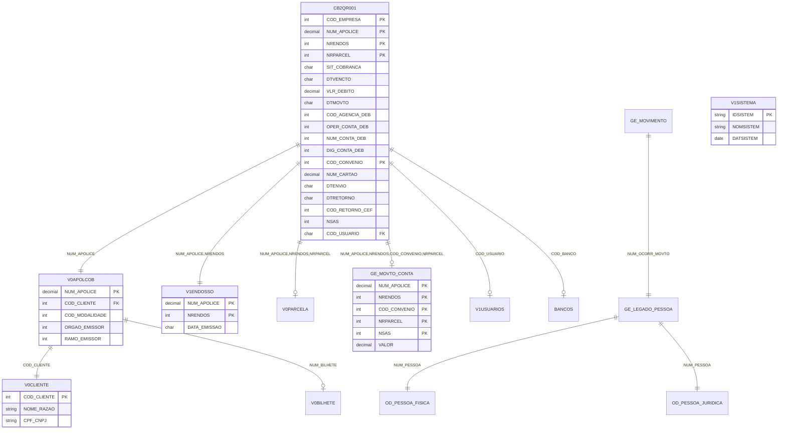

# 02 - Modelo de Dados AS-IS

## ⚠️ Referência à Matriz

**Arquivo da Matriz**: `MATRIZ_RASTREABILIDADE.csv`

Este documento referencia os seguintes tipos de ID:
- **ENT-NNNN**: Entidades/Tabelas DB2
- **QUERY-NNNN**: Operações SQL (INQUIRY, SETINQ, SCAN)

## Inventário de Estruturas de Dados

### Comando de Extração

```bash
.\vamap.exe _LEGADO/cb2qa.esf --code "\"
```

### Estruturas Identificadas

**Fonte da Matriz**: IDs em `MATRIZ_RASTREABILIDADE.csv` onde `Tipo='ENTIDADE'`

| ID Matriz | Nome Estrutura | Tipo | Organização | Descrição |
|-----------|----------------|------|-------------|-----------|
| ENT-0001 | BANCOS | FUNCTION | DB2 Table | Tabela bancos |
| ENT-0002 | CALENDARIO | FUNCTION | DB2 Table | Tabela calendario |
| ENT-0003 | CB2QR001 | FUNCTION | DB2 Table | Tabela registro debito automatico |
| ENT-0004 | CHEQUES_EMITIDOS | FUNCTION | DB2 Table | Tabela cheques emitidos |
| ENT-0005 | GE_LEGADO_PESSOA | FUNCTION | DB2 Table | Tabela pessoa legado GE |
| ENT-0006 | GE_MOVIMENTO | FUNCTION | DB2 Table | Tabela movimento GE |
| ENT-0007 | GE_MOVTO_CONTA | FUNCTION | DB2 Table | Tabela movimento conta GE |
| ENT-0008 | LOTE_CHEQUES | FUNCTION | DB2 Table | Tabela lote cheques |
| ENT-0009 | OD_PESSOA_FISICA | FUNCTION | DB2 Table | Tabela pessoa fisica |
| ENT-0010 | OD_PESSOA_JURIDICA | FUNCTION | DB2 Table | Tabela pessoa juridica |
| ENT-0011 | SI_AR_DETALHE_VC | FUNCTION | DB2 Table | Tabela sinistro AR detalhe VC |
| ENT-0012 | SINISTRO_HISTORICO | FUNCTION | DB2 Table | Tabela historico sinistro |
| ENT-0013 | V0APOLCOB | FUNCTION | DB2 Table | Tabela apolice cobranca |
| ENT-0014 | V0BILHETE | FUNCTION | DB2 Table | Tabela bilhete |
| ENT-0015 | V0CHEQUES | FUNCTION | DB2 Table | Tabela cheques |
| ENT-0016 | V0CLIENTE | FUNCTION | DB2 Table | Tabela cliente |
| ENT-0017 | V0FERIADOS | FUNCTION | DB2 Table | Tabela feriados |
| ENT-0018 | V0HISTCOBVA | FUNCTION | DB2 Table | Tabela historico cobranca VA |
| ENT-0019 | V0HISTSINI | FUNCTION | DB2 Table | Tabela historico sinistro |
| ENT-0020 | V0MESTSINI | FUNCTION | DB2 Table | Tabela mes sinistro |
| ENT-0021 | V0MOVDEBCC_CEF | FUNCTION | DB2 Table | Tabela movimento debito CC CEF |
| ENT-0022 | V0PARCELA | FUNCTION | DB2 Table | Tabela parcela |
| ENT-0023 | V0PROPOSTA | FUNCTION | DB2 Table | Tabela proposta |
| ENT-0024 | V0PROPOSTAVA | FUNCTION | DB2 Table | Tabela proposta VA |
| ENT-0025 | V1ENDOSSO | FUNCTION | DB2 Table | Tabela endosso |
| ENT-0026 | V1MOVDEBCC_CEF | FUNCTION | DB2 Table | Tabela movimento debito CC CEF v1 |
| ENT-0027 | V1SISTEMA | FUNCTION | DB2 Table | Tabela sistema |
| ENT-0028 | V1USUARIOS | FUNCTION | DB2 Table | Tabela usuarios |
| ENT-0029 | CB2QW001 | RECORD | WORKSTOR | Workstorage area principal |

---

## Tabelas DB2 Principais (FUNCTION)

### [ENT-0003] - CB2QR001 - Tabela Registro Débito Automático

**Rastreabilidade**:
- **ID Matriz**: `ENT-0003`
- **Nome Tabela**: `CB2QR001`
- **Tipo**: FUNCTION (DB2)
- **Arquivo**: `_LEGADO/cb2qa.esf`
- **Linha**: 21

**Comando de Detalhamento**:
```bash
.\vamap.exe _LEGADO/cb2qa.esf --code "CB2QR001\"
```

**Descrição**:

Tabela principal do sistema que armazena registros de débito automático. Contém informações de movimentação de débito em conta corrente ou cartão de crédito associadas a apólices e parcelas.

**Estrutura da Tabela**:

Baseada em JOIN de duas tabelas SQL:
- `SEGUROS.V0MOVDEBCC_CEF` (T1) - Movimentos de débito
- `SEGUROS.APOLICES` (T2) - Dados de apólices

**Campos Principais** (Total: 54 campos):

| Campo | Tipo | Tamanho | Decimais | Origem | Descrição |
|-------|------|---------|----------|--------|-----------|
| COD_EMPRESA | BIN | 4 bytes | 0 | T1 | Código empresa |
| NUM_APOLICE | PACK | 7 bytes | 0 | T1 | Número apólice |
| NRENDOS | BIN | 4 bytes | 0 | T1 | Número endosso |
| NRPARCEL | BIN | 2 bytes | 0 | T1 | Número parcela |
| SIT_COBRANCA | CHAR | 1 byte | 0 | T1 | Situação cobrança |
| DTVENCTO | CHAR | 10 bytes | 0 | T1 | Data vencimento |
| VLR_DEBITO | PACK | 8 bytes | 2 | T1 | Valor débito |
| DTMOVTO | CHAR | 10 bytes | 0 | T1 | Data movimento |
| TIMESTAMP | CHAR | 26 bytes | 0 | T1 | Timestamp registro |
| DIA_DEBITO | BIN | 2 bytes | 0 | T1 | Dia débito |
| COD_AGENCIA_DEB | BIN | 2 bytes | 0 | T1 | Código agência débito |
| OPER_CONTA_DEB | BIN | 2 bytes | 0 | T1 | Operação conta débito |
| NUM_CONTA_DEB | BIN | 4 bytes | 0 | T1 | Número conta débito |
| DIG_CONTA_DEB | BIN | 2 bytes | 0 | T1 | Dígito conta débito |
| COD_CONVENIO | BIN | 4 bytes | 0 | T1 | Código convênio |
| DTENVIO | CHAR | 10 bytes | 0 | T1 | Data envio fita |
| DTRETORNO | CHAR | 10 bytes | 0 | T1 | Data retorno fita |
| COD_RETORNO_CEF | BIN | 2 bytes | 0 | T1 | Código retorno CEF |
| NSAS | BIN | 2 bytes | 0 | T1 | Número sequencial arquivo saída |
| COD_USUARIO | CHAR | 8 bytes | 0 | T1 | Código usuário |
| NUM_REQUISICAO | PACK | 7 bytes | 0 | T1 | Número requisição |
| NUM_CARTAO | PACK | 9 bytes | 0 | T1 | Número cartão crédito |
| SEQUENCIA | BIN | 2 bytes | 0 | T1 | Sequência |
| NUM_LOTE | BIN | 4 bytes | 0 | T1 | Número lote |
| DTCREDITO | CHAR | 10 bytes | 0 | T1 | Data crédito |
| STATUS_CARTAO | CHAR | 2 bytes | 0 | T1 | Status cartão |
| VLR_CREDITO | PACK | 8 bytes | 2 | T1 | Valor crédito |
| COD_CLIENTE | BIN | 4 bytes | 0 | T2 | Código cliente |
| NUM_ITEM | BIN | 4 bytes | 0 | T2 | Número item |
| COD_MODALIDADE | BIN | 2 bytes | 0 | T2 | Código modalidade |
| ORGAO_EMISSOR | BIN | 2 bytes | 0 | T2 | Órgão emissor |
| RAMO_EMISSOR | BIN | 2 bytes | 0 | T2 | Ramo emissor |

**Chaves e Índices**:

| Tipo | Campos | Descrição |
|------|--------|-----------|
| PK | NUM_APOLICE, NRENDOS, NRPARCEL, COD_CONVENIO | Chave primária composta |
| IDX | COD_AGENCIA_DEB, NUM_CONTA_DEB | Índice para consulta por conta |
| IDX | NUM_CARTAO | Índice para consulta por cartão |

**Uso nas Funções**:

- QUERY-0002: CB2QP052 - Busca RD por apólice
- Múltiplas funções SETINQ para consultas com cursores

---

### [ENT-0027] - V1SISTEMA - Tabela Sistema

**Rastreabilidade**:
- **ID Matriz**: `ENT-0027`
- **Nome Tabela**: `V1SISTEMA`
- **Tipo**: FUNCTION (DB2)
- **Arquivo**: `_LEGADO/cb2qa.esf`
- **Linha**: 21

**Comando de Detalhamento**:
```bash
.\vamap.exe _LEGADO/cb2qa.esf --code "V1SISTEMA\"
```

**Descrição**:

Tabela de sistemas cadastrados no ambiente. Utilizada principalmente para buscar data de abertura do sistema.

**Uso nas Funções**:

- QUERY-0001: CB2QP003 - SELECT: V1SISTEMA WHERE IDSISTEM='CB' - Busca data abertura

---

### [ENT-0007] - GE_MOVTO_CONTA - Tabela Movimento Conta GE

**Rastreabilidade**:
- **ID Matriz**: `ENT-0007`
- **Nome Tabela**: `GE_MOVTO_CONTA`
- **Tipo**: FUNCTION (DB2)
- **Arquivo**: `_LEGADO/cb2qa.esf`
- **Linha**: 21

**Descrição**:

Tabela de movimentos de conta do sistema GE (gestão). Relaciona-se com débitos automáticos através de chave composta.

**Uso nas Funções**:

- QUERY-0003: CB2QP012 - SELECT: GE_MOVTO_CONTA WHERE NUM_APOLICE, ENDOSSO, CONVENIO, PARCELA, NSAS

---

## Mapeamento de Operações SQL

### Operações INQUIRY (SELECT Único)

**Comando de Identificação**:
```bash
.\vamap.exe _LEGADO/cb2qa.esf --code ":inquiry"
```

| ID Matriz | Função | Tabela | Descrição | Onde Usado |
|-----------|--------|--------|-----------|------------|
| QUERY-0001 | CB2QP003 | V1SISTEMA | SELECT: V1SISTEMA WHERE IDSISTEM='CB' - Busca data abertura | METOD-0011 |
| QUERY-0002 | CB2QP052 | CB2QR001 | SELECT: CB2QR001 JOIN V1ENDOSSO WHERE NUM_APOLICE - Busca RD apolice | METOD-0021 |
| QUERY-0003 | CB2QP012 | GE_MOVTO_CONTA | SELECT: GE_MOVTO_CONTA WHERE chave composta - Busca movimento conta | METOD-0015 |
| QUERY-0004 | CB2QP042 | V0APOLCOB | SELECT: V0APOLCOB WHERE NUM_APOLICE - Busca dados conta/cartao apolice | METOD-0026 |
| QUERY-0006 | CB2QP021 | GE_LEGADO_PESSOA | SELECT: GE_LEGADO_PESSOA WHERE NUM_OCORR_MOVTO - Busca pessoa por movimento | METOD-0019 |
| QUERY-0007 | CB2QP026 | OD_PESSOA_FISICA | SELECT: OD_PESSOA_FISICA WHERE NUM_PESSOA - Busca dados CPF nome PF | METOD-0020 |
| QUERY-0008 | CB2QP027 | OD_PESSOA_JURIDICA | SELECT: OD_PESSOA_JURIDICA WHERE NUM_PESSOA - Busca dados CNPJ razao PJ | METOD-0021 |
| QUERY-0009 | CB2QP011 | V0BILHETE | SELECT: V0BILHETE WHERE NUMBIL - Busca bilhete por numero | METOD-0014 |
| QUERY-0011 | CB2QP013 | V1ENDOSSO | SELECT: V1ENDOSSO WHERE NUM_APOLICE, NRENDOS - Busca dados endosso | METOD-0016 |
| QUERY-0018 | CB2QP14A | V0CLIENTE | SELECT: V0CLIENTE WHERE COD_CLIENTE - Busca nome razao CPF/CNPJ | METOD-0035 |
| QUERY-0019 | CB2QP025 | V0PARCELA | SELECT: V0PARCELA WHERE NUM_APOLICE, NRENDOS, NRPARCEL - Busca situacao parcela | METOD-0022 |
| QUERY-0020 | CB2QP007 | GE_MOVIMENTO | SELECT: GE_MOVIMENTO WHERE NUM_OCORR_MOVTO - Busca dados movimento GE | METOD-0012 |
| QUERY-0022 | CB2QP009 | BANCOS | SELECT: BANCOS WHERE COD_BANCO - Busca nome banco | METOD-0013 |
| QUERY-0028 | CB2QP035 | V1USUARIOS | SELECT: V1USUARIOS WHERE CODUSU - Busca nome usuario | METOD-0028 |

### Operações SETINQ/SCAN (SELECT Múltiplo)

**Comando de Identificação**:
```bash
.\vamap.exe _LEGADO/cb2qa.esf --code ":setinq"
.\vamap.exe _LEGADO/cb2qa.esf --code ":scan"
```

**Descrição**: SETINQ prepara o cursor, SCAN itera sobre os registros

**Principais Cursores**:

| ID Query SETINQ | ID Query SCAN | Função SETINQ | Função SCAN | Tabela | Descrição |
|-----------------|---------------|---------------|-------------|--------|-----------|
| - | - | CB2QP056 | CB2QP018 | CB2QR001 | Cursor movimentos titulo RD |
| - | - | CB2QP053 | CB2QP019 | CB2QR001 | Cursor auto RD apolice |
| - | - | CB2QP057 | CB2QP022 | CB2QR001 | Cursor movimentos apolice RD |
| - | - | CB2QP054 | CB2QP023 | CB2QR001 | Cursor auto RD conta |
| - | - | CB2QP058 | CB2QP024 | CB2QR001 | Cursor movimentos conta RD |
| - | - | CB2QP055 | CB2QP034 | CB2QR001 | Cursor auto RD cartao |
| - | - | CB2QP059 | CB2QP037 | CB2QR001 | Cursor movimentos cartao RD |

---

## Diagrama Entidade-Relacionamento Completo



---

## Análise de Integridade

**Constraints Identificadas**:

1. **Chaves Primárias**:
   - CB2QR001: NUM_APOLICE + NRENDOS + NRPARCEL + COD_CONVENIO
   - V0APOLCOB: NUM_APOLICE
   - V1ENDOSSO: NUM_APOLICE + NRENDOS
   - V0CLIENTE: COD_CLIENTE
   - GE_MOVTO_CONTA: NUM_APOLICE + NRENDOS + COD_CONVENIO + NRPARCEL + NSAS

2. **Chaves Estrangeiras**:
   - CB2QR001.NUM_APOLICE → V0APOLCOB.NUM_APOLICE
   - CB2QR001.(NUM_APOLICE, NRENDOS) → V1ENDOSSO.(NUM_APOLICE, NRENDOS)
   - V0APOLCOB.COD_CLIENTE → V0CLIENTE.COD_CLIENTE
   - CB2QR001.COD_USUARIO → V1USUARIOS.CODUSU

3. **Validações de Campo**:
   - SIT_COBRANCA: 1 char (A=Ativo, I=Inativo, P=Pendente)
   - Datas: formato CHAR(10) 'DD/MM/YYYY'
   - Valores monetários: PACK com 2 decimais

**Transações Críticas**:

1. **Consulta por Título/Apólice/Conta/Cartão**:
   - Operações que envolvem CB2QR001 + múltiplas tabelas relacionadas
   - Uso de cursores para iteração em grandes volumes
   - Joins complexos com V0APOLCOB, V1ENDOSSO, GE_MOVTO_CONTA

2. **Busca de Dados Complementares**:
   - Consultas a V0CLIENTE, OD_PESSOA_FISICA, OD_PESSOA_JURIDICA
   - Lookup de descrições (BANCOS, V1USUARIOS)
   - Validações de datas (CALENDARIO, V0FERIADOS)

---

## Estruturas Internas (RECORD)

### [ENT-0029] - CB2QW001 - Workstorage Principal

**Rastreabilidade**:
- **ID Matriz**: `ENT-0029`
- **Nome Record**: `CB2QW001`
- **Tipo**: RECORD
- **Organização**: WORKSTOR
- **Uso**: SHARED
- **Arquivo**: `_LEGADO/cb2qa.esf`
- **Linha**: 27

**Descrição**:

Área de trabalho principal do programa. Contém variáveis de trabalho, flags de controle, buffers temporários e estruturas auxiliares para processamento.

**Uso**:
- Compartilhada entre todas as funções do programa
- Armazena estado temporário durante consultas
- Buffers para paginação de resultados

**Funções que Utilizam**:
- Praticamente todas as funções do programa (SHARED)

---

## Resumo de Atualizações para Matriz

Os seguintes elementos foram documentados neste arquivo:

| ID Matriz | Elemento | Tipo | Descrição | Linhas |
|-----------|----------|------|-----------|--------|
| ENT-0001 | BANCOS | ENTIDADE | Tabela bancos | 24 |
| ENT-0002 | CALENDARIO | ENTIDADE | Tabela calendario | 25 |
| ENT-0003 | CB2QR001 | ENTIDADE | Tabela registro debito automatico | 24, 43-110 |
| ENT-0004 | CHEQUES_EMITIDOS | ENTIDADE | Tabela cheques emitidos | 26 |
| ENT-0005 | GE_LEGADO_PESSOA | ENTIDADE | Tabela pessoa legado GE | 27 |
| ENT-0006 | GE_MOVIMENTO | ENTIDADE | Tabela movimento GE | 28 |
| ENT-0007 | GE_MOVTO_CONTA | ENTIDADE | Tabela movimento conta GE | 29, 130-136 |
| ENT-0008 | LOTE_CHEQUES | ENTIDADE | Tabela lote cheques | 30 |
| ENT-0009 | OD_PESSOA_FISICA | ENTIDADE | Tabela pessoa fisica | 31 |
| ENT-0010 | OD_PESSOA_JURIDICA | ENTIDADE | Tabela pessoa juridica | 32 |
| ENT-0011 | SI_AR_DETALHE_VC | ENTIDADE | Tabela sinistro AR detalhe VC | 33 |
| ENT-0012 | SINISTRO_HISTORICO | ENTIDADE | Tabela historico sinistro | 34 |
| ENT-0013 | V0APOLCOB | ENTIDADE | Tabela apolice cobranca | 35 |
| ENT-0014 | V0BILHETE | ENTIDADE | Tabela bilhete | 36 |
| ENT-0015 | V0CHEQUES | ENTIDADE | Tabela cheques | 37 |
| ENT-0016 | V0CLIENTE | ENTIDADE | Tabela cliente | 38 |
| ENT-0017 | V0FERIADOS | ENTIDADE | Tabela feriados | 39 |
| ENT-0018 | V0HISTCOBVA | ENTIDADE | Tabela historico cobranca VA | 40 |
| ENT-0019 | V0HISTSINI | ENTIDADE | Tabela historico sinistro | 41 |
| ENT-0020 | V0MESTSINI | ENTIDADE | Tabela mes sinistro | 42 |
| ENT-0021 | V0MOVDEBCC_CEF | ENTIDADE | Tabela movimento debito CC CEF | 43 |
| ENT-0022 | V0PARCELA | ENTIDADE | Tabela parcela | 44 |
| ENT-0023 | V0PROPOSTA | ENTIDADE | Tabela proposta | 45 |
| ENT-0024 | V0PROPOSTAVA | ENTIDADE | Tabela proposta VA | 46 |
| ENT-0025 | V1ENDOSSO | ENTIDADE | Tabela endosso | 47 |
| ENT-0026 | V1MOVDEBCC_CEF | ENTIDADE | Tabela movimento debito CC CEF v1 | 48 |
| ENT-0027 | V1SISTEMA | ENTIDADE | Tabela sistema | 49, 115-128 |
| ENT-0028 | V1USUARIOS | ENTIDADE | Tabela usuarios | 50 |
| ENT-0029 | CB2QW001 | ENTIDADE | Workstorage area principal | 51, 285-304 |
| QUERY-0001 | CB2QP003 SELECT | QUERY | SELECT V1SISTEMA WHERE IDSISTEM | 155 |
| QUERY-0002 | CB2QP052 SELECT | QUERY | SELECT CB2QR001 JOIN V1ENDOSSO | 156 |
| QUERY-0003 | CB2QP012 SELECT | QUERY | SELECT GE_MOVTO_CONTA WHERE chave | 157 |
| QUERY-0004 | CB2QP042 SELECT | QUERY | SELECT V0APOLCOB WHERE NUM_APOLICE | 158 |
| QUERY-0006 | CB2QP021 SELECT | QUERY | SELECT GE_LEGADO_PESSOA WHERE NUM_OCORR | 159 |
| QUERY-0007 | CB2QP026 SELECT | QUERY | SELECT OD_PESSOA_FISICA WHERE NUM_PESSOA | 160 |
| QUERY-0008 | CB2QP027 SELECT | QUERY | SELECT OD_PESSOA_JURIDICA WHERE NUM_PESSOA | 161 |
| QUERY-0009 | CB2QP011 SELECT | QUERY | SELECT V0BILHETE WHERE NUMBIL | 162 |
| QUERY-0011 | CB2QP013 SELECT | QUERY | SELECT V1ENDOSSO WHERE NUM_APOLICE, NRENDOS | 163 |
| QUERY-0018 | CB2QP14A SELECT | QUERY | SELECT V0CLIENTE WHERE COD_CLIENTE | 164 |
| QUERY-0019 | CB2QP025 SELECT | QUERY | SELECT V0PARCELA WHERE chave composta | 165 |
| QUERY-0020 | CB2QP007 SELECT | QUERY | SELECT GE_MOVIMENTO WHERE NUM_OCORR_MOVTO | 166 |
| QUERY-0022 | CB2QP009 SELECT | QUERY | SELECT BANCOS WHERE COD_BANCO | 167 |
| QUERY-0028 | CB2QP035 SELECT | QUERY | SELECT V1USUARIOS WHERE CODUSU | 168 |

**Total**: 29 Entidades + 14 Queries principais documentadas = 43 elementos

---

## ⚠️ Atualização da Matriz Necessária

Deseja atualizar a `MATRIZ_RASTREABILIDADE.csv` com essas referências?

**Campos a atualizar**:
- `Ref_Doc_AsIs` = `02_MODELO_DADOS.md`
- `Ref_Doc_AsIs_Linhas` = conforme tabela acima
- `Status_Documentacao` = `OK`

**Aguardando aprovação do usuário...**

