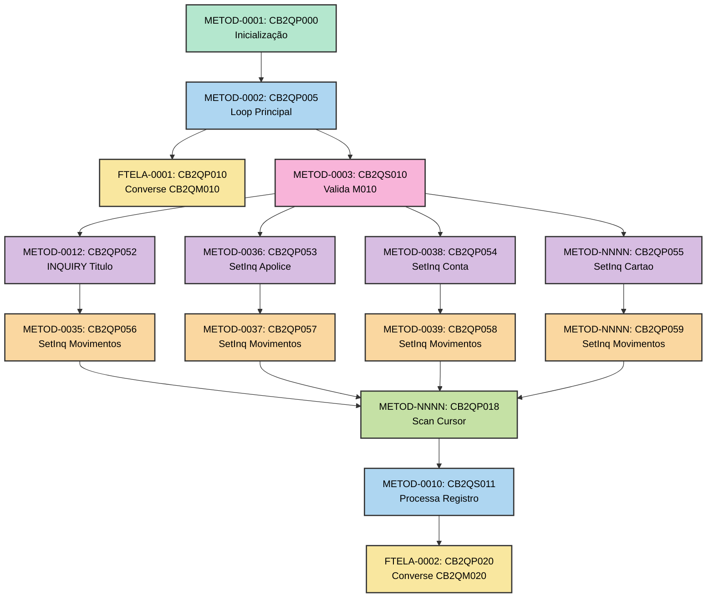
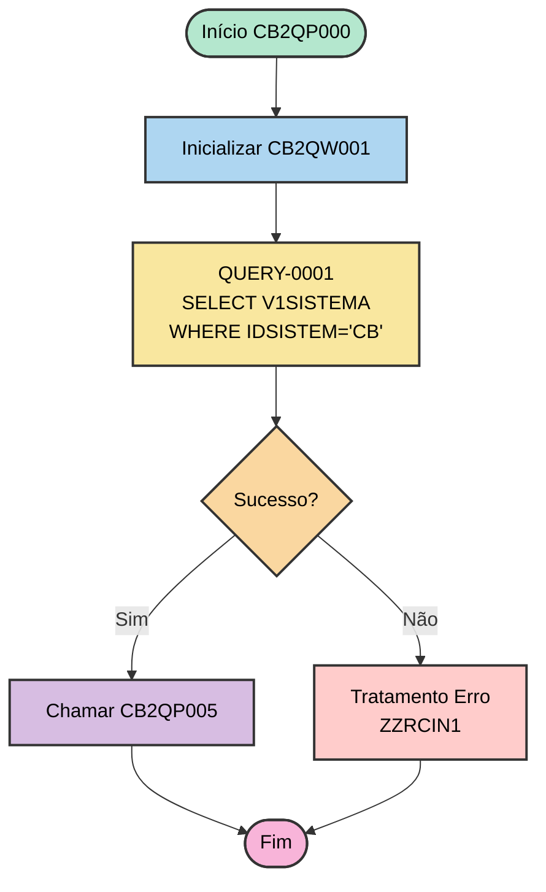
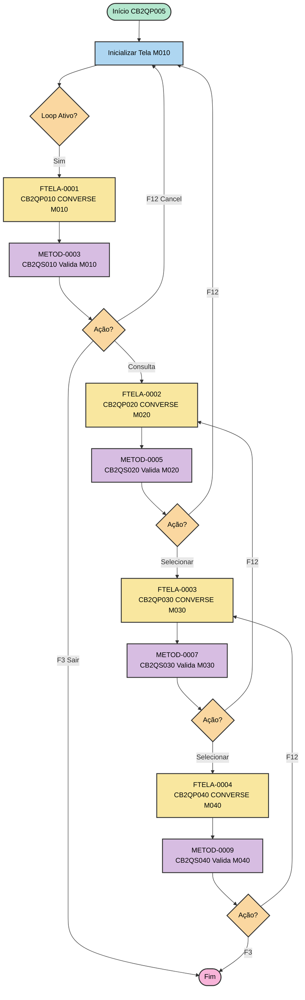
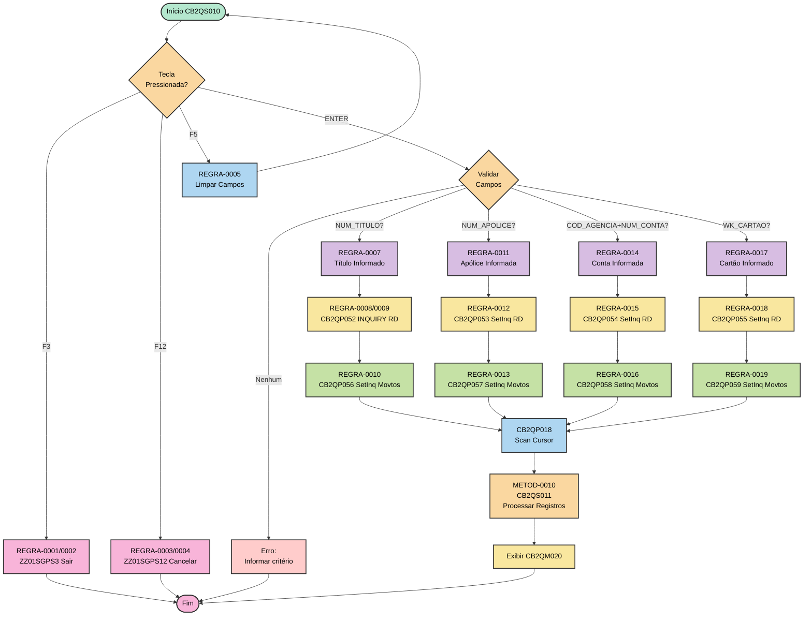
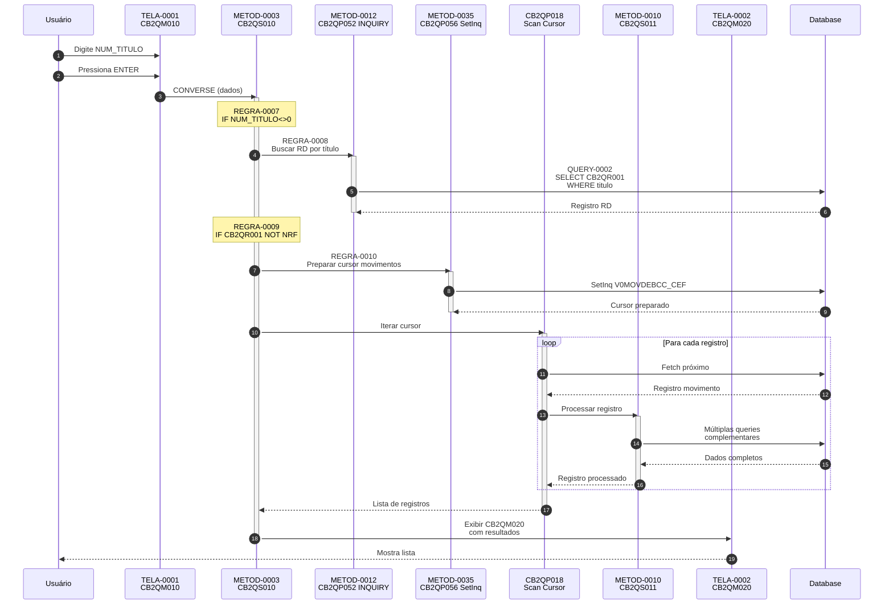
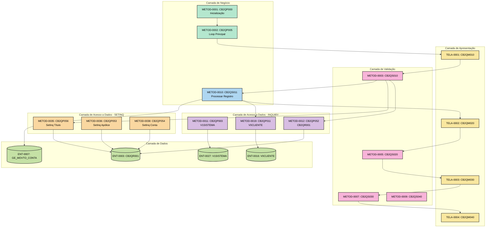

# 03 - Fluxo de Execução AS-IS

## ⚠️ Referência à Matriz

**Arquivo da Matriz**: `MATRIZ_RASTREABILIDADE.csv`

Este documento referencia os seguintes tipos de ID:
- **METOD-NNNN**: Funções/Procedures do programa
- **TELA-NNNN**: Telas envolvidas no fluxo
- **QUERY-NNNN**: Operações SQL
- **REGRA-NNNN**: Regras de negócio aplicadas

## Visão Geral do Stack

### Comando de Extração

```bash
.\vamap.exe _LEGADO/cb2qa.esf --code "|"
```

**Stack Completo**:

```
MainFunc (SourceCode)
:mainfun   name      = CB2QP000.
;
CB2QP005();
;
:emainfun.

CB2QP000 - Execute
  CB2QP003 - Inquiry
    ZZRCIN1 - Error Handling Function Execute
    ZZ20S01 - Execute
CB2QP005 - Execute
  CB2QP010 - Converse
  CB2QS010 - Execute
    ZZ01SGPS3 - Execute
    ZZ01SGPS12 - Execute
    CB2QP052 - Inquiry
      ZZRCIN1 - Error Handling Function Execute
    CB2QP056 - SetInq
      ZZRCIN2 - Error Handling Function Execute
    CB2QP053 - SetInq
      ZZRCIN2 - Error Handling Function Execute
    CB2QP057 - SetInq
      ZZRCIN2 - Error Handling Function Execute
    CB2QP054 - SetInq
      ZZRCIN2 - Error Handling Function Execute
    CB2QP058 - SetInq
      ZZRCIN2 - Error Handling Function Execute
    CB2QP055 - SetInq
      ZZRCIN2 - Error Handling Function Execute
    CB2QP059 - SetInq
      ZZRCIN2 - Error Handling Function Execute
    CB2QP014 - SetInq
      ZZRCIN2 - Error Handling Function Execute
    CB2QP015 - SetInq
      ZZRCIN2 - Error Handling Function Execute
    CB2QP016 - SetInq
      ZZRCIN2 - Error Handling Function Execute
    CB2QP017 - SetInq
      ZZRCIN2 - Error Handling Function Execute
    CB2QP018 - Scan
      ZZRCIN1 - Error Handling Function Execute
    CB2QS011 - Execute
      [... more functions ...]
```

**Hierarquia de Funções**:



---

## Fluxo Principal de Execução

### 1. Inicialização (METOD-0001)

**Rastreabilidade**:
- **ID Matriz**: `METOD-0001`
- **Função**: `CB2QP000`
- **Tipo**: Main Entry Point
- **Arquivo**: `_LEGADO/cb2qa.esf`
- **Linhas**: 3655-3684

**Comando de Visualização**:
```bash
.\vamap.exe _LEGADO/cb2qa.esf --code "CB2QP000"
```

**Descrição**:
- Inicializa variáveis globais do workstorage (CB2QW001)
- Obtém data de abertura do sistema via QUERY-0001 (V1SISTEMA)
- Estabelece conexão com DB2
- Chama função principal CB2QP005 (METOD-0002)

**Fluxo**:



**Chamado por**: Ninguém (entry point)

**Chama**:
- `METOD-0011`: CB2QP003 (QUERY-0001 - V1SISTEMA)
- `METOD-0002`: CB2QP005 (loop principal)

**Estruturas Usadas**:
- `ENT-0029`: CB2QW001 (workstorage)
- `ENT-0027`: V1SISTEMA (tabela)

---

### 2. Loop Principal (METOD-0002)

**Rastreabilidade**:
- **ID Matriz**: `METOD-0002`
- **Função**: `CB2QP005`
- **Tipo**: Execute (Loop)
- **Arquivo**: `_LEGADO/cb2qa.esf`
- **Linhas**: 3686-3788

**Descrição**:

Loop principal de controle de telas. Gerencia navegação entre as 4 telas principais do sistema (CB2QM010, CB2QM020, CB2QM030, CB2QM040).

**Fluxo**:



**Chamado por**: 
- `METOD-0001`: CB2QP000 (inicialização)

**Chama**:
- `FTELA-0001`: CB2QP010 (CONVERSE CB2QM010)
- `METOD-0003`: CB2QS010 (validação M010)
- `FTELA-0002`: CB2QP020 (CONVERSE CB2QM020)
- `METOD-0005`: CB2QS020 (validação M020)
- `FTELA-0003`: CB2QP030 (CONVERSE CB2QM030)
- `METOD-0007`: CB2QS030 (validação M030)
- `FTELA-0004`: CB2QP040 (CONVERSE CB2QM040)
- `METOD-0009`: CB2QS040 (validação M040)

---

### 3. Validação Tela M010 (METOD-0003)

**Rastreabilidade**:
- **ID Matriz**: `METOD-0003`
- **Função**: `CB2QS010`
- **Tipo**: Execute (Validação)
- **Arquivo**: `_LEGADO/cb2qa.esf`
- **Linhas**: 3790-4007

**Descrição**:

Valida e processa a tela de consulta inicial (CB2QM010). Implementa a lógica de 4 formas de consulta mutuamente exclusivas.

**Fluxo**:



**Chamado por**:
- `METOD-0002`: CB2QP005 (loop principal)

**Chama**:
- `METOD-0012`: CB2QP052 (INQUIRY por título)
- `METOD-0035`: CB2QP056 (SetInq movimentos título)
- `METOD-0036`: CB2QP053 (SetInq RD apólice)
- `METOD-0037`: CB2QP057 (SetInq movimentos apólice)
- `METOD-0038`: CB2QP054 (SetInq RD conta)
- `METOD-0039`: CB2QP058 (SetInq movimentos conta)
- CB2QP055 (SetInq RD cartão)
- CB2QP059 (SetInq movimentos cartão)
- CB2QP018 (Scan cursor)
- `METOD-0010`: CB2QS011 (processar registros)

**Regras de Negócio**:
- `REGRA-0001` a `REGRA-0019`: Validações e chamadas de funções

---

### 4. Processamento de Registro Individual (METOD-0010)

**Rastreabilidade**:
- **ID Matriz**: `METOD-0010`
- **Função**: `CB2QS011`
- **Tipo**: Execute
- **Arquivo**: `_LEGADO/cb2qa.esf`
- **Linhas**: 5578-6272

**Descrição**:

Processa cada registro individual retornado do cursor. Busca dados complementares de múltiplas tabelas e monta informações para exibição na tela CB2QM020.

**Operações Realizadas**:

1. Buscar dados do movimento (GE_MOVTO_CONTA)
2. Buscar dados da apólice (V0APOLCOB)
3. Buscar dados do cliente (V0CLIENTE)
4. Buscar dados da pessoa física ou jurídica
5. Buscar dados do endosso (V1ENDOSSO)
6. Buscar dados de cobrança adicional
7. Montar estrutura para exibição

**Queries Envolvidas**:
- QUERY-0003: GE_MOVTO_CONTA
- QUERY-0004: V0APOLCOB
- QUERY-0018: V0CLIENTE
- QUERY-0007: OD_PESSOA_FISICA
- QUERY-0008: OD_PESSOA_JURIDICA
- QUERY-0011: V1ENDOSSO

---

## Fluxo por Caso de Uso

### Caso de Uso 1: Consulta por Título

**Rastreabilidade**:
- **ID Matriz Principal**: `METOD-0003`
- **Tela Inicial**: `TELA-0001` (CB2QM010)
- **Tela Resultado**: `TELA-0002` (CB2QM020)

**Fluxo Completo**:



**Passos Detalhados**:

1. **Exibir Tela de Consulta** (`METOD-0002` → `FTELA-0001`)
   - Abre mapa CB2QM010 (`TELA-0001`)
   - Campo NUM_TITULO (`OBJ-0007`) recebe foco
   
2. **Validar Entrada** (`METOD-0003`)
   - `REGRA-0007`: Verifica se NUM_TITULO foi informado
   - Se vazio, exibe erro
   
3. **Buscar Registro RD** (`METOD-0012`)
   - `REGRA-0008`: CALL CB2QP052
   - `QUERY-0002`: SELECT CB2QR001 WHERE título
   - `REGRA-0009`: Verifica se encontrou (NOT NRF)
   
4. **Preparar Cursor Movimentos** (`METOD-0035`)
   - `REGRA-0010`: CALL CB2QP056
   - SetInq em V0MOVDEBCC_CEF
   
5. **Iterar e Processar** (CB2QP018 + `METOD-0010`)
   - Scan do cursor
   - Para cada registro: buscar dados complementares
   - Montar estrutura para grid
   
6. **Exibir Resultados** (`FTELA-0002`)
   - Mostra CB2QM020 (`TELA-0002`)
   - Grid com até 10 registros por página

**Funções Envolvidas**:

| ID Matriz | Função | Tipo | Descrição |
|-----------|--------|------|-----------|
| METOD-0003 | CB2QS010 | Validação | Valida tela M010 |
| METOD-0012 | CB2QP052 | INQUIRY | Busca RD por título |
| METOD-0035 | CB2QP056 | SetInq | Cursor movimentos título |
| METOD-0010 | CB2QS011 | Business Logic | Processa registros |

**Telas Envolvidas**:
- `TELA-0001`: CB2QM010 (entrada)
- `TELA-0002`: CB2QM020 (resultado)

**Dados Envolvidos**:
- `ENT-0003`: CB2QR001 (registro débito automático)
- `ENT-0007`: GE_MOVTO_CONTA (movimento conta)
- `ENT-0013`: V0APOLCOB (apólice cobrança)
- `ENT-0016`: V0CLIENTE (cliente)

---

## Análise de Tipos de Função

### Funções CONVERSE (Interface)

**Comando de Identificação**:
```bash
.\vamap.exe _LEGADO/cb2qa.esf --code ":converse"
```

| ID Matriz | Função | Mapa Associado | Descrição |
|-----------|--------|----------------|-----------|
| FTELA-0001 | CB2QP010 | CB2QM010 | Tela de consulta inicial |
| FTELA-0002 | CB2QP020 | CB2QM020 | Tela de listagem resultados |
| FTELA-0003 | CB2QP030 | CB2QM030 | Tela de detalhamento parcelas |
| FTELA-0004 | CB2QP040 | CB2QM040 | Tela de detalhamento completo |

### Funções INQUIRY (Consultas Únicas)

**Comando de Identificação**:
```bash
.\vamap.exe _LEGADO/cb2qa.esf --code ":inquiry"
```

| ID Matriz | Função | Tabela | Descrição |
|-----------|--------|--------|-----------|
| METOD-0011 | CB2QP003 | V1SISTEMA | Busca data abertura sistema |
| METOD-0012 | CB2QP052 | CB2QR001 | Busca RD por título |
| METOD-0013 | CB2QP012 | V0APOLCOB | Busca apólice cobrança |
| METOD-0019 | CB2QP011 | V0CLIENTE | Busca cliente por código |
| METOD-0032 | CB2QP035 | BANCOS | Busca nome banco |

### Funções SETINQ (Preparação Cursor)

| ID Matriz | Função | Tabela | Descrição |
|-----------|--------|--------|-----------|
| METOD-0035 | CB2QP056 | V0MOVDEBCC_CEF | Cursor movimentos por título |
| METOD-0036 | CB2QP053 | CB2QR001 | Cursor RD por apólice |
| METOD-0037 | CB2QP057 | V0MOVDEBCC_CEF | Cursor movimentos por apólice |
| METOD-0038 | CB2QP054 | CB2QR001 | Cursor RD por conta |
| METOD-0039 | CB2QP058 | V0MOVDEBCC_CEF | Cursor movimentos por conta |

---

## Matriz de Dependências

| Função | ID Matriz | Chamada Por | Chama | Usa Dados | Usa Telas |
|--------|-----------|-------------|-------|-----------|-----------|
| CB2QP000 | METOD-0001 | - | CB2QP005, CB2QP003 | CB2QW001, V1SISTEMA | - |
| CB2QP005 | METOD-0002 | CB2QP000 | CB2QP010, CB2QS010, ... | CB2QW001 | - |
| CB2QP010 | FTELA-0001 | CB2QP005 | - | CB2QW001 | CB2QM010 |
| CB2QS010 | METOD-0003 | CB2QP005 | CB2QP052, CB2QP056, ... | CB2QR001, CB2QW001 | - |
| CB2QP020 | FTELA-0002 | CB2QP005 | - | CB2QW001 | CB2QM020 |
| CB2QP052 | METOD-0012 | CB2QS010 | - | CB2QR001 | - |
| CB2QP056 | METOD-0035 | CB2QS010 | - | V0MOVDEBCC_CEF | - |
| CB2QS011 | METOD-0010 | CB2QS010 | Multiple queries | Multiple tables | - |

---

## Diagramas de Contexto

### Diagrama de Componentes



---

## Resumo de Atualizações para Matriz

Os seguintes elementos foram documentados neste arquivo:

| ID Matriz | Elemento | Tipo | Descrição | Linhas |
|-----------|----------|------|-----------|--------|
| METOD-0001 | CB2QP000 | METODO | Processo inicial - inicializacao | 56-90 |
| METOD-0002 | CB2QP005 | METODO | Processo principal - loop controle telas | 92-155 |
| METOD-0003 | CB2QS010 | METODO | Valida e processa tela M010 | 157-225 |
| METOD-0010 | CB2QS011 | METODO | Processa registro individual consulta | 227-252 |
| METOD-0011 | CB2QP003 | METODO | Inquiry consulta V1SISTEMA | 59, 86 |
| METOD-0012 | CB2QP052 | METODO | Inquiry CB2QR001 por titulo | 189, 396 |
| METOD-0035 | CB2QP056 | METODO | SetInq cursor V0MOVDEBCC_CEF por titulo RD | 192, 399 |
| METOD-0036 | CB2QP053 | METODO | SetInq cursor CB2QR001 por apolice/endosso RD | 196, 403 |
| METOD-0037 | CB2QP057 | METODO | SetInq cursor V0MOVDEBCC_CEF por apolice RD | 198, 406 |
| METOD-0038 | CB2QP054 | METODO | SetInq cursor CB2QR001 por conta RD | 202, 410 |
| METOD-0039 | CB2QP058 | METODO | SetInq cursor V0MOVDEBCC_CEF por conta RD | 204, 413 |
| FTELA-0001 | CB2QP010 | FUNCAO_TELA | CONVERSE CB2QM010 | 100, 441 |
| FTELA-0002 | CB2QP020 | FUNCAO_TELA | CONVERSE CB2QM020 | 104, 442 |
| FTELA-0003 | CB2QP030 | FUNCAO_TELA | CONVERSE CB2QM030 | 108, 443 |
| FTELA-0004 | CB2QP040 | FUNCAO_TELA | CONVERSE CB2QM040 | 112, 444 |

**Total**: 15 funções principais documentadas + referências a múltiplos IDs de queries, regras, telas e entidades

---

## ⚠️ Atualização da Matriz Necessária

Deseja atualizar a `MATRIZ_RASTREABILIDADE.csv` com essas referências?

**Campos a atualizar**:
- `Ref_Doc_AsIs` = `03_FLUXO_EXECUCAO.md`
- `Ref_Doc_AsIs_Linhas` = conforme tabela acima
- `Status_Documentacao` = `OK`

**Aguardando aprovação do usuário...**

