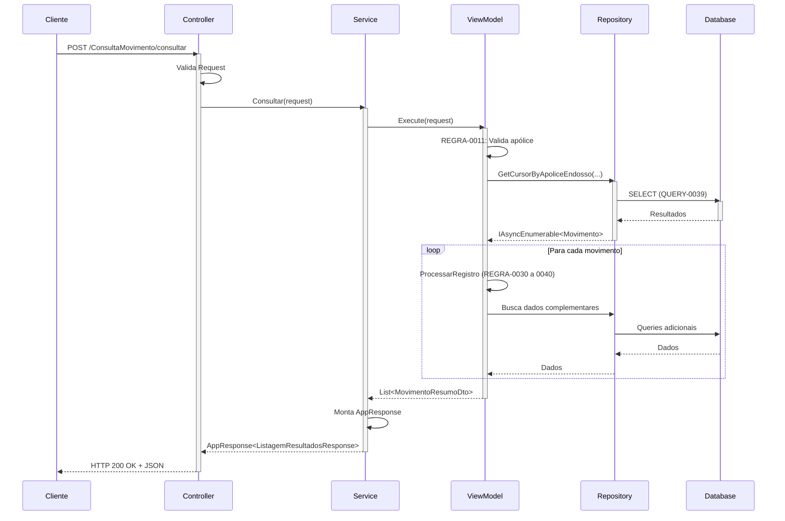

# 09 - USE CASES & FLOWS

## Objetivo

Documentar os fluxos end-to-end do sistema CB2QA, demonstrando como as camadas interagem desde a entrada do usuário via API até a resposta final, incluindo diagramas de sequência, casos de uso principais e fluxos de navegação entre telas.

## Mapeamento de Legado

### Origem
- **Arquivo**: `_LEGADO/cb2qa.esf`
- **Fluxo Principal**: METOD-0002 (CB2QP005 - Loop principal de controle de telas)
- **Telas**: M010 → M020 → M030 → M040
- **Linhas**: 3686-3788 (loop principal)

### Destino
- **Padrão**: REST API com navegação via endpoints
- **Fluxo**: Request HTTP → Controller → Service → ViewModel → Repository → Database

## Especificação Técnica

### 1. Caso de Uso Principal: Consulta de Movimentos

**Rastreabilidade**:
- **ID Matriz**: METOD-0002 (loop principal) + METOD-0003 (consulta M010)
- **Origem**: CB2QP005 + CB2QS010
- **Telas Envolvidas**: TELA-0001, TELA-0002, TELA-0003, TELA-0004

#### 1.1 Fluxo Completo (Happy Path)

```
┌─────────────┐
│   Cliente   │
│  (Browser)  │
└──────┬──────┘
       │
       │ 1. POST /ConsultaMovimento/consultar
       │    { numeroApolice: "12345", numeroEndosso: "001" }
       ▼
┌──────────────────────────────────────────────────────────┐
│                      API Layer                           │
│  ┌─────────────────────────────────────────────────┐    │
│  │  ConsultaMovimentoController                     │    │
│  │  - Valida request                                │    │
│  │  - Chama service                                 │    │
│  └────────┬─────────────────────────────────────────┘    │
└───────────┼──────────────────────────────────────────────┘
            │
            │ 2. service.Consultar(request)
            ▼
┌──────────────────────────────────────────────────────────┐
│                  Application Layer                       │
│  ┌─────────────────────────────────────────────────┐    │
│  │  ConsultaMovimentoService                        │    │
│  │  - try/catch                                     │    │
│  │  - Chama ViewModel                               │    │
│  │  - Monta AppResponse                             │    │
│  └────────┬─────────────────────────────────────────┘    │
│           │                                               │
│           │ 3. viewModel.Execute(request)                 │
│           ▼                                               │
│  ┌─────────────────────────────────────────────────┐    │
│  │  ProcessarConsultaM010ViewModel                  │    │
│  │  - REGRA-0007 a REGRA-0029                       │    │
│  │  - Determina critério busca                      │    │
│  │  - Chama repositories                            │    │
│  └────────┬─────────────────────────────────────────┘    │
└───────────┼──────────────────────────────────────────────┘
            │
            │ 4. repository.GetCursorByApoliceEndosso()
            ▼
┌──────────────────────────────────────────────────────────┐
│                Infrastructure Layer                      │
│  ┌─────────────────────────────────────────────────┐    │
│  │  MovimentoDebitoCCRepository                     │    │
│  │  - Monta SQL com parâmetros                      │    │
│  │  - Executa via Dapper                            │    │
│  └────────┬─────────────────────────────────────────┘    │
└───────────┼──────────────────────────────────────────────┘
            │
            │ 5. SELECT * FROM MovimentoDebitoCCCef WHERE ...
            ▼
┌──────────────────────────────────────────────────────────┐
│                    SQL Server Database                    │
│  - Aplica índices (QUERY-0039)                           │
│  - Retorna resultados                                    │
└────────┬──────────────────────────────────────────────────┘
         │
         │ 6. IAsyncEnumerable<MovimentoDebitoCCCef>
         ▼
      (Retorno sobe pelas camadas)
         │
         │ 7. List<MovimentoResumoDto>
         ▼
      ViewModel → Service → Controller
         │
         │ 8. HTTP 200 OK
         │    AppResponse<ListagemResultadosResponse>
         ▼
┌─────────────┐
│   Cliente   │
│  - Exibe     │
│    lista     │
└─────────────┘
```

#### 1.2 Casos de Uso Detalhados

##### UC01: Consultar por Número da Apólice

**Pré-condições**: Usuário possui número de apólice e endosso

**Fluxo Principal**:

1. Cliente envia `POST /ConsultaMovimento/consultar`
   ```json
   {
     "numeroApolice": "123456",
     "numeroEndosso": "001"
   }
   ```

2. `ConsultaMovimentoController.Consultar()`:
   - Valida request não nulo
   - Chama `service.Consultar(request)`

3. `ConsultaMovimentoService.Consultar()`:
   - try-catch wrapper
   - Chama `processarConsultaM010ViewModel.Execute(request)`

4. `ProcessarConsultaM010ViewModel.Execute()`:
   - **REGRA-0011**: Verifica apólice informada
   - **REGRA-0012**: Busca registros RD por apólice
   - **REGRA-0013**: Busca movimentos por apólice
   - Para cada movimento:
     - Chama `ProcessarRegistroViewModel` (**REGRA-0030 a REGRA-0040**)
     - Monta `MovimentoResumoDto`

5. `MovimentoDebitoCCRepository.GetCursorByApoliceEndosso()`:
   - **QUERY-0039**: SQL com JOIN e GROUP BY
   - Retorna IAsyncEnumerable

6. ViewModel retorna `List<MovimentoResumoDto>`

7. Service monta `AppResponse<ListagemResultadosResponse>`:
   ```json
   {
     "data": {
       "quantidadeTotal": 25,
       "numeroPagina": 1,
       "totalPaginas": 3,
       "movimentos": [...]
     },
     "message": "25 movimentos encontrados",
     "isSuccess": true
   }
   ```

8. Controller retorna HTTP 200 OK

**Fluxos Alternativos**:

- **A1**: Apólice não encontrada
  - **REGRA-0029**: Nenhum registro encontrado
  - ViewModel lança `InvalidOperationException`
  - Service captura e retorna `isSuccess: false`
  - Controller retorna HTTP 422 Unprocessable Entity

- **A2**: Nenhum critério informado
  - **REGRA-0020**: Validação falha
  - ViewModel lança exception
  - HTTP 422 com mensagem "Informar ao menos um critério de pesquisa"

##### UC02: Navegar para Detalhes de Parcelas

**Pré-condições**: Usuário selecionou movimento na listagem M020

**Fluxo Principal**:

1. Cliente clica em movimento específico

2. Cliente envia `GET /DetalheParcelas/{apolice}/{endosso}?codigoConvenio={convenio}`

3. `DetalheParcelasController.ObterParcelas()`:
   - Valida path params
   - Monta `DetalheParcelasRequest`
   - Chama `service.ObterParcelas(request)`

4. `DetalheParcelaService.ObterParcelas()`:
   - Chama `processarSelecaoM020ViewModel.Execute(request)`

5. `ProcessarSelecaoM020ViewModel.Execute()`:
   - **REGRA-0076**: Abre cursor parcelas (**QUERY-0042**)
   - **REGRA-0078 a REGRA-0088**: Itera e filtra parcelas
   - Para cada parcela:
     - **REGRA-0083**: Valida tipo segurado se convenio especial
     - **REGRA-0102**: Busca situação parcela
     - Monta `ParcelaDetalheDto`

6. Repository executa **QUERY-0042**:
   ```sql
   SELECT * FROM MovimentoDebitoCCCef
   WHERE NumeroApolice = @NumeroApolice
     AND NumeroEndosso = @NumeroEndosso
     AND CodigoConvenio = @CodigoConvenio
   ORDER BY NumeroParcela, DataVencimento
   ```

7. Retorna lista de parcelas com paginação

8. HTTP 200 OK com `ListagemResultadosResponse`

##### UC03: Visualizar Detalhe Completo do Movimento

**Pré-condições**: Usuário selecionou parcela específica na M030

**Fluxo Principal**:

1. Cliente envia `GET /DetalheMovimento/{apolice}/{endosso}/{parcela}?codigoConvenio={convenio}`

2. `DetalheMovimentoController.ObterDetalheCompleto()`:
   - Valida params
   - Chama `service.ObterDetalheCompleto(request)`

3. `DetalheMovimentoService.ObterDetalheCompleto()`:
   - Busca movimento específico via repository
   - Processa via `ProcessarRegistroViewModel`
   - **REGRA-0032**: Determina tipo documento (**METOD-0051**)
   - **REGRA-0033**: Busca cliente
   - **REGRA-0036**: Processa cheques se houver
   - **REGRA-0037**: Busca movimento GE se houver
   - Busca banco (**QUERY-0022**)
   - Busca usuário (**QUERY-0028**)
   - Busca movimento de conta (**QUERY-0003**)
   - Monta `MovimentoDetalheCompletoDto` com TODOS os dados

4. Múltiplas queries executadas:
   - **QUERY-0042**: Movimento principal
   - **QUERY-0018**: Cliente
   - **QUERY-0007/0008**: Pessoa física/jurídica
   - **QUERY-0022**: Nome banco
   - **QUERY-0028**: Nome usuário
   - **QUERY-0003**: Movimento conta GE (se aplicável)

5. HTTP 200 OK com todos detalhes do movimento

### 2. Diagrama de Sequência: Consulta Completa



### 3. Fluxo de Navegação Entre Telas

```
┌──────────────────────────────────────────────────────────────┐
│                    FLUXO DE NAVEGAÇÃO                        │
└──────────────────────────────────────────────────────────────┘

     [M010 - Consulta]
     POST /ConsultaMovimento/consultar
     ┌─────────────────────────────────┐
     │  - Informar critérios:          │
     │    • Número Título              │
     │    • Número Apólice/Endosso     │
     │    • Dados Conta                │
     │    • Número Cartão              │
     │  - REGRA-0007 a REGRA-0029      │
     └────────────┬────────────────────┘
                  │
                  │ (25 movimentos encontrados)
                  ▼
     [M020 - Listagem Resultados]
     POST /ConsultaMovimento/resultados
     ┌─────────────────────────────────┐
     │  - Lista paginada (10/página)   │
     │  - Resumo movimento:            │
     │    • Apólice/Endosso            │
     │    • Convênio                   │
     │    • Nome Segurado              │
     │    • Tipo Cobrança              │
     │  - Seleção de item              │
     └────────────┬────────────────────┘
                  │
                  │ (Seleciona movimento)
                  ▼
     [M030 - Detalhe Parcelas]
     GET /DetalheParcelas/{apolice}/{endosso}
     ┌─────────────────────────────────┐
     │  - Lista parcelas:              │
     │    • Número Parcela             │
     │    • Data Vencimento            │
     │    • Valor Débito               │
     │    • Situação Cobrança          │
     │    • Situação Parcela           │
     │  - REGRA-0075 a REGRA-0109      │
     │  - Seleção de parcela           │
     └────────────┬────────────────────┘
                  │
                  │ (Seleciona parcela)
                  ▼
     [M040 - Detalhe Completo]
     GET /DetalheMovimento/{apolice}/{endosso}/{parcela}
     ┌─────────────────────────────────┐
     │  - TODOS os detalhes:           │
     │    • Nome/CPF/CNPJ              │
     │    • Dados Bancários            │
     │    • Datas (envio/retorno/pgto) │
     │    • Cheque (se aplicável)      │
     │    • Código Retorno             │
     │    • Movimento Conta GE         │
     │  - Informações completas        │
     └─────────────────────────────────┘
```

### 4. Tratamento de Erros por Camada

#### 4.1 API Layer

```
Client Request
     │
     ▼
┌─────────────────────┐
│ Controller          │
│ - BadRequest (400)  │──► Request inválido/nulo
│ - OK (200)          │──► Sucesso
│ - UnprocessableEntity│──► Erro de negócio (422)
│ - NotFound (404)    │──► Recurso não encontrado
└─────────────────────┘
```

#### 4.2 Application Layer

```
Service (try-catch)
     │
     ├──► InvalidOperationException  ──► Erro de negócio (isSuccess=false)
     │
     └──► Exception genérica  ──► Erro técnico (isSuccess=false, log)
```

#### 4.3 Business Logic Layer

```
ViewModel
     │
     └──► Lança InvalidOperationException ──► Service captura e trata
```

### 5. Casos de Teste End-to-End

#### Teste E2E-001: Consulta por Apólice com Sucesso

```gherkin
Dado que existe movimento para apólice "123456" endosso "001"
Quando cliente faz POST /ConsultaMovimento/consultar
  Com { "numeroApolice": "123456", "numeroEndosso": "001" }
Então resposta deve ser HTTP 200 OK
  E isSuccess deve ser true
  E data.quantidadeTotal deve ser > 0
  E data.movimentos deve conter MovimentoResumoDto
```

#### Teste E2E-002: Consulta sem Critérios - Erro

```gherkin
Dado que cliente não informou nenhum critério
Quando cliente faz POST /ConsultaMovimento/consultar
  Com { }
Então resposta deve ser HTTP 422 Unprocessable Entity
  E isSuccess deve ser false
  E message deve conter "ao menos um critério"
```

#### Teste E2E-003: Fluxo Completo M010 → M040

```gherkin
Dado que existe movimento completo no sistema
Quando cliente realiza fluxo:
  1. POST /ConsultaMovimento/consultar (M010)
  2. POST /ConsultaMovimento/resultados?pagina=1 (M020)
  3. GET /DetalheParcelas/{apolice}/{endosso} (M030)
  4. GET /DetalheMovimento/{apolice}/{endosso}/{parcela} (M040)
Então todas respostas devem ser HTTP 200 OK
  E todos isSuccess devem ser true
  E M040 deve conter todos detalhes completos
```

## Dependências

- **Depende de**: Todos documentos anteriores (01 a 08)
- **Necessário para**: 10_TESTING_STRATEGY.md

## Checklist de Implementação

- [x] **OBRIGATÓRIO**: Fluxo completo M010 → M020 → M030 → M040 documentado
- [x] **OBRIGATÓRIO**: Diagrama de sequência para caso principal
- [x] **OBRIGATÓRIO**: Casos de uso detalhados (UC01, UC02, UC03)
- [x] **OBRIGATÓRIO**: Fluxo de navegação entre telas
- [x] **OBRIGATÓRIO**: Tratamento de erros por camada
- [x] **OBRIGATÓRIO**: Casos de teste E2E especificados
- [x] **OBRIGATÓRIO**: Referências a regras de negócio (REGRA-*)
- [x] **OBRIGATÓRIO**: Referências a queries (QUERY-*)
- [x] **OBRIGATÓRIO**: Happy path e fluxos alternativos

## Rastreabilidade Completa

### Fluxos Mapeados

| Fluxo | Telas Envolvidas | IDs Matriz | Status |
|-------|------------------|------------|--------|
| Consulta Principal | TELA-0001 → TELA-0002 | METOD-0002, METOD-0003 | COMPLETED |
| Detalhe Parcelas | TELA-0002 → TELA-0003 | METOD-0005, METOD-0056 | COMPLETED |
| Detalhe Movimento | TELA-0003 → TELA-0004 | METOD-0007, METOD-0008 | COMPLETED |
| Fluxo Completo | TELA-0001 a TELA-0004 | METOD-0002 (loop principal) | COMPLETED |

### Status na Matriz

Atualizar `MATRIZ_RASTREABILIDADE.csv`:
- Status_Documentacao = COMPLETED para use cases
- Ref_Doc_Abordagem = 09_USE_CASES_FLOWS.md

