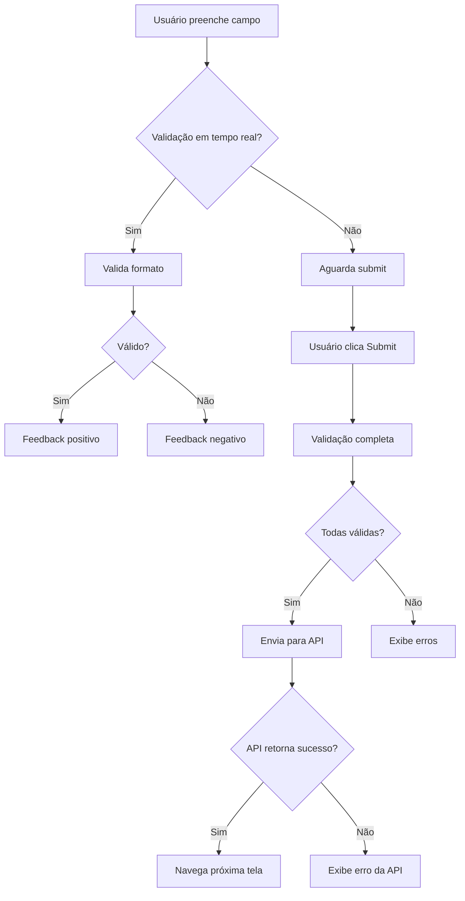

# Especificação de Formulários e Validações

## 📋 Visão Geral

Este documento especifica todos os formulários, campos, validações e regras de negócio implementadas no frontend, com rastreabilidade completa para as regras legadas.

## 🎯 Formulário 1: Consulta de Apólice (TELA-0101)

### Rastreabilidade
- **ID Matriz**: TELA-0101 (VGFNM010)
- **Componente**: `ConsultaApolicePage`
- **Endpoint**: `POST /api/alteracao-dados-basicos/consultar-apolice`

### Campos do Formulário

| Campo | ID Matriz | Tipo | Obrigatório | Validações | Componente |
|-------|-----------|------|-------------|------------|-------------|
| NUM_APOLICE | OBJ-0107 | string | ✅ Sim | REGRA-0108 | NumberInput |
| COD_SUBGRUPO | OBJ-0108 | string | ❌ Não | - | NumberInput |

### Validações Implementadas

#### REGRA-0108: Verifica Apólice Informada
**ID Matriz**: REGRA-0108  
**Origem**: `_LEGADO/vgfna.esf`, linha ~3125  
**Mapeamento Backend**: `ProcessarConsultaM010ViewModel.Execute()`

**Especificação**:
```typescript
// Validação no Frontend
if (!numeroApolice || numeroApolice === '0' || numeroApolice.trim() === '') {
  setMessage({ 
    type: 'error', 
    text: 'INFORME A APOLICE' 
  });
  return false;
}
```

**Comportamento**:
- ✅ Valida se campo está preenchido
- ✅ Valida se não é "0"
- ✅ Valida se não está vazio após trim
- ✅ Exibe mensagem de erro em `MessageDisplay`
- ✅ Impede submissão do formulário

**Feedback Visual**:
- Campo com borda vermelha
- Mensagem de erro abaixo do campo
- Botão de submit desabilitado até validação passar

---

#### REGRA-0109: Busca Apólice no Banco
**ID Matriz**: REGRA-0109  
**Origem**: `_LEGADO/vgfna.esf`, linha ~3130  
**Mapeamento Backend**: `ProcessarConsultaM010ViewModel.Execute()`

**Especificação**:
```typescript
// Validação após chamada à API
const response = await consultarApolice({ numeroApolice });

if (!response.isSuccess || !response.data) {
  setMessage({ 
    type: 'error', 
    text: response.message || 'APOLICE NAO ENCONTRADA' 
  });
  return false;
}
```

**Comportamento**:
- ✅ Chama API após validação de campo
- ✅ Verifica resposta `isSuccess`
- ✅ Verifica se `data` não é null
- ✅ Exibe mensagem de erro se apólice não encontrada
- ✅ Navega para próxima tela se sucesso

**Estados de Loading**:
- Botão "Consultar" mostra spinner durante requisição
- Formulário desabilitado durante requisição
- Feedback visual de carregamento

---

### Validações de Formato

#### NUM_APOLICE
- **Tipo**: Numérico
- **Tamanho Máximo**: 20 caracteres (conforme backend)
- **Formato**: Apenas números (0-9)
- **Validação em Tempo Real**: ✅
  - Remove caracteres não numéricos
  - Limita tamanho máximo

**Implementação**:
```typescript
const handleNumeroApoliceChange = (value: string) => {
  // Remove caracteres não numéricos
  const numericValue = value.replace(/\D/g, '');
  
  // Limita tamanho
  if (numericValue.length <= 20) {
    setNumeroApolice(numericValue);
  }
};
```

---

## 🎯 Formulário 2: Alteração de Subgrupo (TELA-0102)

### Rastreabilidade
- **ID Matriz**: TELA-0102 (VGFNM020)
- **Componente**: `AlteracaoSubgrupoPage`
- **Endpoint**: `PUT /api/alteracao-dados-basicos/alterar-subgrupo`

### Campos do Formulário

| Campo | Tipo | Obrigatório | Condicional | Validações | Componente |
|-------|------|-------------|-------------|------------|-------------|
| NUM_APOLICE | string | ✅ | - | Read-only | DisplayField |
| COD_SUBGRUPO | string | ✅ | - | Read-only | DisplayField |
| PERI_FATURAMENTO | number | ⚠️ | Se TIPO_COBRANCA=2 | REGRA-0111 | SelectInput |
| FORMA_FATURAMENTO | number | ⚠️ | Se TIPO_COBRANCA=2 | REGRA-0112 | SelectInput |
| FORMA_AVERBACAO | number | ❌ | - | REGRA-0114 | SelectInput |
| TIPO_PLANO | number | ❌ | - | - | SelectInput |
| PLANO_ASSOCIADO | char (S/N) | ❌ | - | Regex: ^[SN]$ | RadioGroup |
| TIPO_COBRANCA | number | ❌ | - | REGRA-0110 | SelectInput |
| VALIDAR_MATRICULA | char (S/N) | ⚠️ | Se TIPO_APOLICE=2 | REGRA-0113 | RadioGroup |
| ENDERECO_COBRANCA | number | ❌ | - | - | NumberInput |
| BCO_COBRANCA | number | ❌ | - | - | NumberInput |
| AGE_COBRANCA | number | ❌ | - | - | NumberInput |
| DAC_COBRANCA | number | ❌ | - | - | NumberInput |

### Validações Cruzadas

#### REGRA-0110: Valida Tipo de Cobrança = 2 (Fatura)
**ID Matriz**: REGRA-0110  
**Origem**: `_LEGADO/vgfna.esf`, linha ~3200

**Especificação**:
```typescript
// Validação no Frontend
if (tipoCobranca === 2) {
  // REGRA-0111: Período faturamento obrigatório
  if (!periodoFaturamento || periodoFaturamento === 0) {
    setMessage({ 
      type: 'error', 
      text: 'PERIODO FATURAMENTO OBRIGATORIO' 
    });
    return false;
  }
  
  // REGRA-0112: Forma faturamento obrigatória
  if (!formaFaturamento || formaFaturamento === 0) {
    setMessage({ 
      type: 'error', 
      text: 'FORMA FATURAMENTO OBRIGATORIA' 
    });
    return false;
  }
} else {
  // Se tipo cobrança diferente de 2, período e forma devem ser 0
  setPeriodoFaturamento(0);
  setFormaFaturamento(0);
}
```

**Comportamento**:
- ✅ Validação em tempo real quando `TIPO_COBRANCA` muda
- ✅ Campos `PERI_FATURAMENTO` e `FORMA_FATURAMENTO` tornam-se obrigatórios se `TIPO_COBRANCA = 2`
- ✅ Auto-preenche com 0 se `TIPO_COBRANCA ≠ 2`
- ✅ Feedback visual: campos obrigatórios marcados com `*`
- ✅ Validação antes de submit

**Feedback Visual**:
- Campos obrigatórios destacados quando `TIPO_COBRANCA = 2`
- Mensagem de erro específica para cada campo
- Indicador visual de obrigatoriedade condicional

---

#### REGRA-0111: Período Faturamento Obrigatório
**ID Matriz**: REGRA-0111  
**Condição**: `TIPO_COBRANCA = 2`

**Especificação**:
```typescript
if (tipoCobranca === 2 && (!periodoFaturamento || periodoFaturamento === 0)) {
  return {
    isValid: false,
    message: 'PERIODO FATURAMENTO OBRIGATORIO',
    field: 'periodoFaturamento'
  };
}
```

**Feedback Visual**:
- Campo marcado como obrigatório (`*`)
- Borda vermelha se vazio ao tentar submeter
- Mensagem de erro abaixo do campo

---

#### REGRA-0112: Forma Faturamento Obrigatória
**ID Matriz**: REGRA-0112  
**Condição**: `TIPO_COBRANCA = 2`

**Especificação**: Similar à REGRA-0111, aplicada ao campo `FORMA_FATURAMENTO`

---

#### REGRA-0113: Validar Matrícula Deve Ser 'S' para Específica
**ID Matriz**: REGRA-0113  
**Origem**: `_LEGADO/vgfna.esf`, linha ~3220  
**Condição**: `TIPO_APOLICE = 2`

**Especificação**:
```typescript
// Validação no Frontend
if (tipoApolice === 2 && validarMatricula !== 'S') {
  setMessage({ 
    type: 'error', 
    text: 'VALIDAR MATRICULA DEVE SER S PARA ESPECIFICA' 
  });
  return false;
}
```

**Comportamento**:
- ✅ Validação quando `TIPO_APOLICE = 2`
- ✅ Campo `VALIDAR_MATRICULA` deve ser 'S'
- ✅ Radio button 'Sim' pré-selecionado se `TIPO_APOLICE = 2`
- ✅ Validação antes de submit

**Feedback Visual**:
- Radio button 'Sim' destacado
- Mensagem de erro se tentar selecionar 'Não'
- Tooltip explicativo

---

#### REGRA-0114: Protege Campos por Tipo de Faturamento e Apólice
**ID Matriz**: REGRA-0114  
**Origem**: `_LEGADO/vgfna.esf`, linha ~3225

**Especificação**:
```typescript
// Proteção condicional de campos
useEffect(() => {
  const tipoApolice = apolice?.tipoApolice;
  const tipoFaturamento = formData.tipoCobranca;
  
  if ((tipoFaturamento === 1 || tipoFaturamento === 3) && tipoApolice === 2) {
    setReadOnlyFields([
      'periodoFaturamento',
      'formaFaturamento',
      'formaAverbacao'
    ]);
  } else {
    setReadOnlyFields([]);
  }
}, [formData.tipoCobranca, apolice?.tipoApolice]);
```

**Comportamento**:
- ✅ Campos protegidos quando: `(TIPO_FATURAMENTO = 1 OR 3) AND TIPO_APOLICE = 2`
- ✅ Campos ficam desabilitados (read-only)
- ✅ Feedback visual: campos com estilo de desabilitado
- ✅ Tooltip explicando por que está protegido

**Feedback Visual**:
- Campos com fundo cinza claro
- Cursor "not-allowed"
- Ícone de informação com tooltip explicativo

---

### Validações de Formato

#### PLANO_ASSOCIADO e VALIDAR_MATRICULA
- **Tipo**: Char (S/N)
- **Validação Regex**: `^[SN]$`
- **Componente**: RadioGroup
- **Valores Permitidos**: 'S' ou 'N'

#### Campos Numéricos
- **Tipo**: Number
- **Validação**: Apenas números inteiros
- **Componente**: NumberInput
- **Validação em Tempo Real**: Remove caracteres não numéricos

---

## 🎯 Formulário 3: Alteração de Termo Adesão (TELA-0103)

### Rastreabilidade
- **ID Matriz**: TELA-0103 (VGFNM030)
- **Componente**: `AlteracaoTermoAdesaoPage`
- **Endpoint**: `PUT /api/alteracao-dados-basicos/alterar-termo-adesao`

### Campos e Validações

Similar ao Formulário 2 (Alteração de Subgrupo), mas aplicado ao termo adesão.

**Validações Idênticas**:
- REGRA-0110, REGRA-0111, REGRA-0112, REGRA-0113, REGRA-0114

---

## 📊 Resumo de Validações

| ID Regra | Descrição | Tipo | Quando Aplicada | Feedback |
|----------|-----------|------|-----------------|----------|
| REGRA-0108 | Apólice informada | Obrigatória | Submit | Mensagem erro |
| REGRA-0109 | Apólice encontrada | API | Após consulta | Mensagem erro |
| REGRA-0110 | Tipo cobrança = 2 | Cruzada | Mudança campo | Validação tempo real |
| REGRA-0111 | Período faturamento obrigatório | Condicional | Se TIPO_COBRANCA=2 | Campo obrigatório |
| REGRA-0112 | Forma faturamento obrigatória | Condicional | Se TIPO_COBRANCA=2 | Campo obrigatório |
| REGRA-0113 | Validar matrícula = 'S' | Condicional | Se TIPO_APOLICE=2 | Mensagem erro |
| REGRA-0114 | Protege campos | Condicional | Se condições atendidas | Campos desabilitados |

---

## 🎨 Padrões de Validação

### Validação em Tempo Real
- ✅ Validação ao perder foco (onBlur)
- ✅ Validação ao mudar valor (onChange) para campos críticos
- ✅ Feedback imediato

### Validação no Submit
- ✅ Validação completa antes de enviar
- ✅ Exibe todas as mensagens de erro
- ✅ Foca no primeiro campo com erro

### Mensagens de Erro
- ✅ Mensagens claras e específicas
- ✅ Mensagens em português
- ✅ Mensagens alinhadas com backend
- ✅ Exibição em `MessageDisplay` component

### Estados Visuais
- ✅ Campo válido: Borda verde
- ✅ Campo inválido: Borda vermelha
- ✅ Campo obrigatório: Asterisco (*)
- ✅ Campo desabilitado: Fundo cinza, cursor not-allowed

---

## 🔄 Fluxo de Validação



---

## 📝 Checklist de Implementação

- [x] REGRA-0108: Validação apólice informada
- [x] REGRA-0109: Validação apólice encontrada
- [x] REGRA-0110: Validação tipo cobrança = 2
- [x] REGRA-0111: Período faturamento obrigatório
- [x] REGRA-0112: Forma faturamento obrigatória
- [x] REGRA-0113: Validar matrícula = 'S'
- [x] REGRA-0114: Proteção condicional de campos
- [x] Validações de formato (regex, tipos)
- [x] Feedback visual de validação
- [x] Mensagens de erro padronizadas
- [x] Validação em tempo real
- [x] Validação no submit

