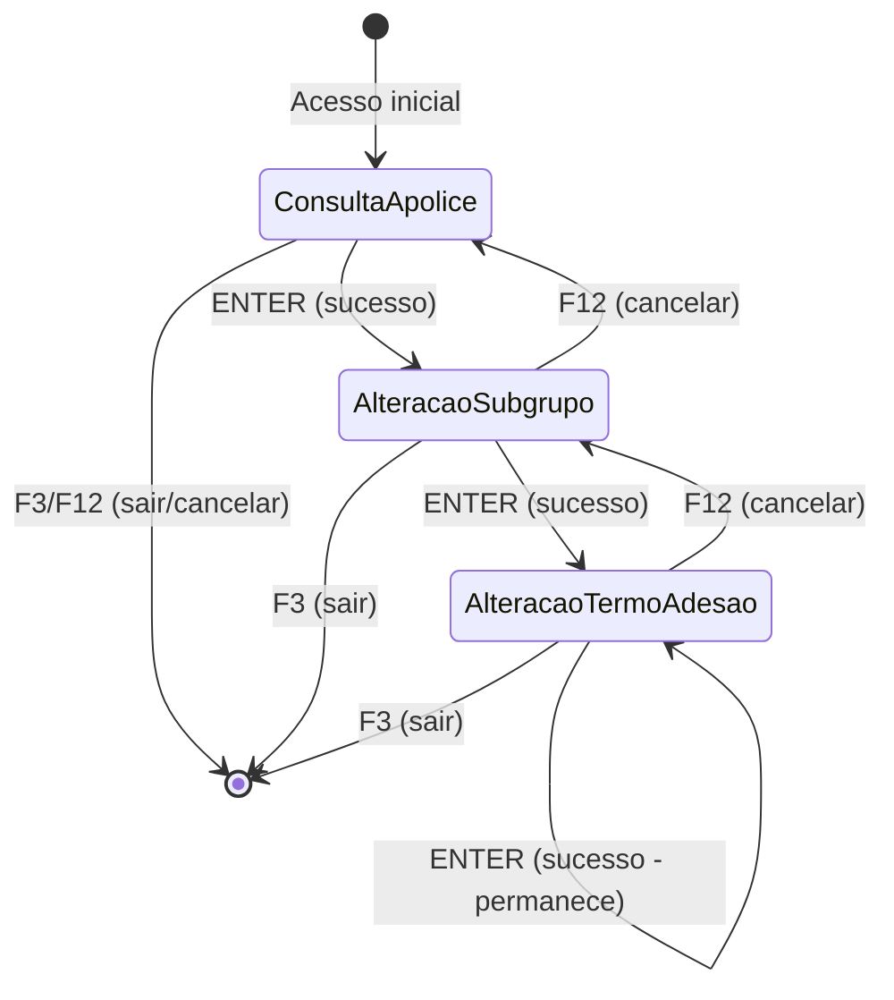

# Especificação de Navegação e Roteamento

## 📋 Visão Geral

Este documento especifica o fluxo de navegação, roteamento e transições entre telas do sistema VGFNA, mapeando o fluxo legado para navegação moderna com React Router.

## 🗺️ Mapeamento de Navegação Legado → React Router

### Fluxo Original (Legado)

```
VGFNP002 (Loop Principal)
  ├─> W01A0035 = 'MOSTRA TELA M010'
  │   └─> VGFNP005 (CONVERSE VGFNM010) → TELA-0101
  │       └─> VGFNS002 (Valida M010)
  │           └─> W01A0035 = 'MOSTRA TELA M020'
  │
  ├─> W01A0035 = 'MOSTRA TELA M020'
  │   └─> VGFNP025 (CONVERSE VGFNM020) → TELA-0102
  │       └─> VGFNS003 (Valida M020)
  │           └─> W01A0035 = 'MOSTRA TELA M030'
  │
  └─> W01A0035 = 'MOSTRA TELA M030'
      └─> VGFNP035 (CONVERSE VGFNM030) → TELA-0103
          └─> VGFNS004 (Valida M030)
```

### Fluxo Moderno (React Router)

```
/consulta-apolice (ConsultaApolicePage)
  ├─> Sucesso → /alteracao-subgrupo (AlteracaoSubgrupoPage)
  │   └─> Sucesso → /alteracao-termo-adesao (AlteracaoTermoAdesaoPage)
  │
  ├─> F12/Cancelar → /consulta-apolice (volta ao início)
  └─> F3/Sair → / (home)
```

## 🛣️ Rotas Definidas

### Rota 1: Consulta de Apólice
**Rastreabilidade**: TELA-0101 (VGFNM010)  
**Rota**: `/consulta-apolice`  
**Componente**: `ConsultaApolicePage`  
**Estado Legado**: `W01A0035 = 'MOSTRA TELA M010'`

**Acesso**:
- ✅ Rota padrão (`/`)
- ✅ Redirecionamento de rotas inválidas
- ✅ Navegação via `navigate('/consulta-apolice')`

**Navegação de Saída**:
- ✅ **Sucesso (ENTER)**: Navega para `/alteracao-subgrupo` com state
- ✅ **F3 (Sair)**: Navega para `/` (home)
- ✅ **F12 (Cancelar)**: Navega para `/` (home)
- ✅ **F1 (Ajuda)**: Abre modal (não navega)

**State Passado**:
```typescript
navigate('/alteracao-subgrupo', {
  state: {
    apolice: {
      numeroApolice: string;
      tipoApolice: number;
      // ... outros campos
    },
    subgrupo: {
      codigoSubgrupo: number;
      // ... outros campos
    }
  }
});
```

---

### Rota 2: Alteração de Subgrupo
**Rastreabilidade**: TELA-0102 (VGFNM020)  
**Rota**: `/alteracao-subgrupo`  
**Componente**: `AlteracaoSubgrupoPage`  
**Estado Legado**: `W01A0035 = 'MOSTRA TELA M020'`

**Acesso**:
- ✅ Navegação via `navigate('/alteracao-subgrupo', { state })`
- ✅ Proteção: Redireciona para `/consulta-apolice` se state ausente

**Navegação de Saída**:
- ✅ **Sucesso (ENTER)**: Navega para `/alteracao-termo-adesao` com state
- ✅ **F12 (Cancelar)**: Navega para `/consulta-apolice` (volta)
- ✅ **F3 (Sair)**: Navega para `/` (home)
- ✅ **F1 (Ajuda)**: Abre modal (não navega)

**State Passado**:
```typescript
navigate('/alteracao-termo-adesao', {
  state: {
    apolice: ApoliceData;
    subgrupo: SubgrupoData;
  }
});
```

**Proteção de Rota**:
```typescript
// Verificação de state ao montar componente
useEffect(() => {
  if (!location.state?.apolice) {
    navigate('/consulta-apolice');
  }
}, [location.state, navigate]);
```

---

### Rota 3: Alteração de Termo Adesão
**Rastreabilidade**: TELA-0103 (VGFNM030)  
**Rota**: `/alteracao-termo-adesao`  
**Componente**: `AlteracaoTermoAdesaoPage`  
**Estado Legado**: `W01A0035 = 'MOSTRA TELA M030'`

**Acesso**:
- ✅ Navegação via `navigate('/alteracao-termo-adesao', { state })`
- ✅ Proteção: Redireciona para `/alteracao-subgrupo` se state ausente

**Navegação de Saída**:
- ✅ **Sucesso (ENTER)**: Exibe mensagem de sucesso, permanece na tela
- ✅ **F12 (Cancelar)**: Navega para `/alteracao-subgrupo` (volta)
- ✅ **F3 (Sair)**: Navega para `/` (home)
- ✅ **F1 (Ajuda)**: Abre modal (não navega)

**Proteção de Rota**: Similar à rota anterior

---

## 🔄 Fluxo Completo de Navegação



---

## 🎯 Mapeamento de Ações

### Teclas de Função → Navegação

| Tecla | ID Regra | Ação | Navegação | Rota Destino |
|-------|----------|------|-----------|--------------|
| ENTER | REGRA-0108, REGRA-0109 | Consultar | `navigate('/alteracao-subgrupo')` | `/alteracao-subgrupo` |
| F3 | REGRA-0101, REGRA-0102 | Sair | `navigate('/')` | `/` (home) |
| F12 | REGRA-0105, REGRA-0106 | Cancelar | `navigate('/')` ou `navigate(-1)` | Volta ou home |
| F1 | - | Ajuda | Modal (sem navegação) | - |
| F4 | REGRA-0103 | Consulta Externa | Modal (sem navegação) | - |
| F10 | REGRA-0104 | Inclusão | Modal (sem navegação) | - |

---

## 📦 Gerenciamento de Estado

### State via React Router

**Vantagens**:
- ✅ State temporário entre navegações
- ✅ Não persiste após refresh
- ✅ Simples de implementar

**Uso**:
```typescript
// Passar state
navigate('/alteracao-subgrupo', {
  state: { apolice, subgrupo }
});

// Receber state
const location = useLocation();
const { apolice, subgrupo } = location.state as LocationState;
```

### State via Context (Opcional)

Para casos mais complexos, pode-se usar Context API:

```typescript
// AlteracaoDadosBasicosContext.tsx
interface AlteracaoContextType {
  apolice: ApoliceData | null;
  subgrupo: SubgrupoData | null;
  termoAdesao: TermoAdesaoData | null;
  setApolice: (data: ApoliceData) => void;
  // ...
}
```

---

## 🛡️ Proteção de Rotas

### Rota Protegida: AlteracaoSubgrupoPage

```typescript
useEffect(() => {
  const state = location.state as LocationState;
  
  if (!state?.apolice) {
    // Redireciona se não houver dados da apólice
    navigate('/consulta-apolice', { 
      replace: true 
    });
  }
}, [location.state, navigate]);
```

### Rota Protegida: AlteracaoTermoAdesaoPage

```typescript
useEffect(() => {
  const state = location.state as LocationState;
  
  if (!state?.apolice || !state?.subgrupo) {
    // Redireciona se não houver dados necessários
    navigate('/alteracao-subgrupo', { 
      replace: true 
    });
  }
}, [location.state, navigate]);
```

---

## 🔙 Navegação de Volta (Breadcrumb)

### Breadcrumb Visual (Opcional)

```typescript
<Breadcrumb>
  <BreadcrumbItem 
    onClick={() => navigate('/consulta-apolice')}
    active={currentRoute === '/consulta-apolice'}
  >
    Consulta Apólice
  </BreadcrumbItem>
  <BreadcrumbItem 
    onClick={() => navigate('/alteracao-subgrupo')}
    active={currentRoute === '/alteracao-subgrupo'}
    disabled={!hasApolice}
  >
    Alteração Subgrupo
  </BreadcrumbItem>
  <BreadcrumbItem 
    onClick={() => navigate('/alteracao-termo-adesao')}
    active={currentRoute === '/alteracao-termo-adesao'}
    disabled={!hasSubgrupo}
  >
    Alteração Termo Adesão
  </BreadcrumbItem>
</Breadcrumb>
```

---

## ⚠️ Tratamento de Erros de Navegação

### Erro: State Ausente

```typescript
// Redirecionamento automático
if (!location.state?.apolice) {
  navigate('/consulta-apolice', { 
    replace: true 
  });
  return null; // Não renderiza componente
}
```

### Erro: Dados Inválidos

```typescript
// Validação de dados recebidos
if (!apolice?.numeroApolice) {
  setMessage({ 
    type: 'error', 
    text: 'DADOS DA APOLICE INVALIDOS' 
  });
  navigate('/consulta-apolice', { replace: true });
}
```

---

## 📊 Resumo de Navegação

| Origem | Ação | Destino | State Passado | Proteção |
|--------|------|---------|---------------|----------|
| `/consulta-apolice` | ENTER (sucesso) | `/alteracao-subgrupo` | `{ apolice, subgrupo }` | ✅ |
| `/consulta-apolice` | F3/F12 | `/` | - | - |
| `/alteracao-subgrupo` | ENTER (sucesso) | `/alteracao-termo-adesao` | `{ apolice, subgrupo }` | ✅ |
| `/alteracao-subgrupo` | F12 | `/consulta-apolice` | - | - |
| `/alteracao-subgrupo` | F3 | `/` | - | - |
| `/alteracao-termo-adesao` | F12 | `/alteracao-subgrupo` | `{ apolice, subgrupo }` | ✅ |
| `/alteracao-termo-adesao` | F3 | `/` | - | - |

---

## 🎨 Feedback Visual de Navegação

### Loading State Durante Navegação

```typescript
const [navigating, setNavigating] = useState(false);

const handleNavigate = async (path: string, state?: any) => {
  setNavigating(true);
  
  // Simula delay de processamento
  await new Promise(resolve => setTimeout(resolve, 100));
  
  navigate(path, { state });
  setNavigating(false);
};
```

### Indicador de Progresso

```typescript
<ProgressIndicator>
  <Step completed={currentRoute === '/consulta-apolice' || currentRoute !== '/consulta-apolice'}>
    Consulta
  </Step>
  <Step completed={currentRoute === '/alteracao-subgrupo' || currentRoute === '/alteracao-termo-adesao'}>
    Subgrupo
  </Step>
  <Step completed={currentRoute === '/alteracao-termo-adesao'}>
    Termo Adesão
  </Step>
</ProgressIndicator>
```

---

## 📝 Checklist de Implementação

- [x] Rotas definidas no `AppRoutes.tsx`
- [x] Navegação entre telas implementada
- [x] State passado via `navigate()`
- [x] Proteção de rotas implementada
- [x] Tratamento de erros de navegação
- [x] Redirecionamento de rotas inválidas
- [x] Rota padrão configurada
- [x] Mapeamento de teclas para navegação
- [x] Feedback visual de navegação

